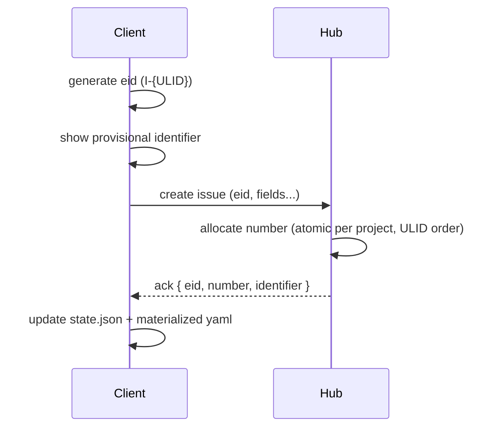
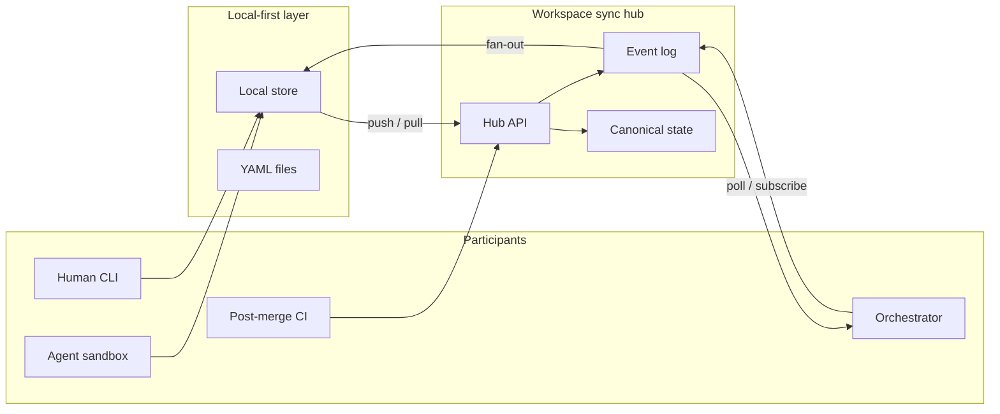
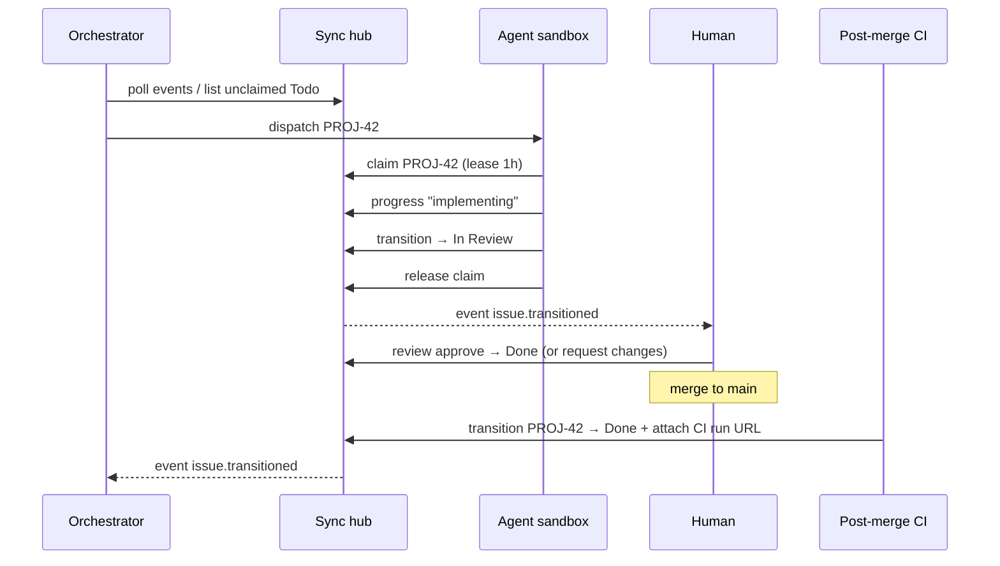
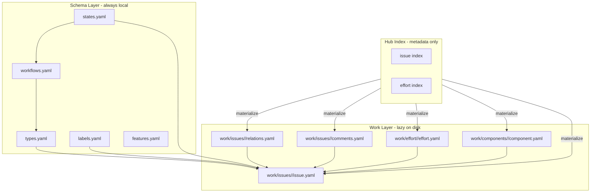

# Track — Software Requirements Document

**Version:** 0.4 (draft)  
**Status:** Draft for review  
**Last updated:** 2026-06-06

> **Companion document:** Product intent, goals, principles, and personas are in the [Product Requirements Document](./PRD.md).

This document specifies *how* Track is designed and built: domain model, on-disk formats, CLI surface, sync hub architecture, requirements, and delivery milestones.

---

## 1. Reference systems analysis

### 1.1 Plane Compose (primary model for "as code")

Plane Compose implements **"project as code"** for Plane. Track adopts many of its patterns while changing the runtime target from Plane SaaS to a local-first Track instance.

| Plane Compose concept | Track equivalent | Notes |
|----------------------|------------------|-------|
| `plane init` + template | `track init` + template | Git URL or local path for templates |
| `schema/states.yaml` | `schema/states.yaml` | States grouped into semantic categories |
| `schema/workflows.yaml` | `schema/workflows.yaml` | Allowed transitions per issue type |
| `schema/types.yaml` | `schema/types.yaml` | Per-type workflow + custom properties |
| `schema/labels.yaml` | `schema/labels.yaml` | Flat labels |
| `schema/features.yaml` | `schema/features.yaml` | Toggle efforts, components, hierarchy, etc. |
| `work/workitems.yaml` | `work/issues/<eid>/issue.yaml` | Lazy materialization; `<eid>` = prefixed ID (e.g. `I-…`) |
| `work/cycles.yaml` | `work/effort/<eid>/effort.yaml` | Lazy materialization per effort |
| `work/modules.yaml` | `work/components/<eid>/component.yaml` | Lazy materialization per component |
| `work/milestones.yaml` | *(not used)* | Effort `kind: milestone` |
| `.plane/state.json` | `.track/state.json` | Maps entity `eid` → content hashes + hub sync metadata |
| `plane push/pull/diff/validate` | `track push/pull/diff/validate` | Same operational vocabulary |
| `plane schema validate` (offline) | `track schema validate` | No network required |
| Connection/credentials separate from repo | Same | Secrets in `~/.config/track/`, not in Git |

**Key Plane Compose behaviors to replicate:**

- Dependency-ordered push: schema before work
- Content-hash skip for unchanged items
- Client-generated prefixed `eid` (`I-{ULID}`) at create; hub-allocated `number` for display (§2.12)
- `--dry-run`, `--schema-only`, `--work-only`, `--resume`, `--exit-code`
- Schema import modes: reconnect IDs only, merge, force

**Intentional divergences:**

- Track's backend is local-first, not Plane API
- Broader domain vocabulary (effort vs cycle, component vs module)
- Agent actor model is first-class (see Linear)

### 1.2 Linear GraphQL schema (primary model for domain richness)

Linear's [schema.graphql](https://github.com/linear/linear/blob/master/packages/sdk/src/schema.graphql) informs the **entity model** and relationships, adapted for personal/multi-domain use.

| Linear concept | Track mapping | Relevance |
|--------------|---------------|-----------|
| `Issue` | `Issue` | Core work item: title, description, priority, assignee, state, labels, estimate, dates |
| `Issue.identifier` (e.g. ENG-123) | `identifier` / `number` | Hub-allocated display; see §2.12 |
| `IssueRelation` (blocks, duplicate, related) | `Relation` (typed, see §2.11) | Superset: adds `requires`, `extends`, `parent` |
| `Issue.parent` / children | `parent` relation type | Hierarchy via relations, not a separate field |
| `WorkflowState` + `state` on Issue | State + state group | Per-project states with semantic groups for reporting |
| `Cycle` | `Effort` (time-boxed flavor) | Sprints, iterations; progress history optional later |
| `Project` | `Project` | Top-level container with its own schema |
| `ProjectMilestone` | `Effort` (milestone flavor) or nested effort | Target dates, associated issues, progress |
| `ProjectRelation` | `EffortRelation` | Efforts depend on other efforts (roadmap) |
| `IssueLabel` | `Label` | Flat, colored tags |
| `Comment` | `Comment` | Issue comments with edit supersession (§2.14) |

**Linear patterns worth adopting:**

- Typed directed relations with execution vs semantic categories (§2.11)
- Priority as ordered enum (Linear: 0=none … 1=urgent)
- `createdAt` / `updatedAt` / `completedAt` lifecycle timestamps (`completed_at`; cancelled vs done determined by state group)
- Optional `estimate` as numeric (points) with type-level or project-level scale config
- Agent delegation distinct from human assignee (agent executes; human owns)

**Linear patterns to simplify or defer:**

- Multi-team hierarchy, facets, customer requests
- YJS collaborative document state
- Rich in-app notification graph (hub events + CLI suffice for v1)

---

## 2. Domain model

### 2.1 Entity hierarchy

```
Workspace (sync hub)
├── Hub config          (infra-as-code; separate repo, not co-mingled)
└── Project[]           (independent directories on disk)
    ├── track.yaml      (includes workspace association + project eid)
    ├── Schema          (types, states, workflows, labels, features)
    ├── Issue[]
    ├── Relation[]        (typed issue ↔ issue edges)
    ├── Effort[]          (hub index; lazy dirs under work/effort/)
    ├── EffortRelation[]  (hub; K- eids; included when effort materialized)
    ├── Component[]       (lazy dirs under work/components/)
    └── Comment[]         (hub; materialized with parent issue)
```

Each **project** is an independent directory. Its manifest associates the project with exactly one **workspace** (hub). Multiple project directories may share a workspace; each maintains its own schema and work files.


### 2.2 Prefixed entity IDs (typed ULIDs)

Track uses **prefixed ULIDs** for hub-persisted entities: a single-letter type prefix, a hyphen, and a standard 26-character ULID (Crockford base32). This makes logs, events, and debugging immediately scannable — a bare ULID gives no hint whether you are looking at an issue, project, or relation.

#### Format

```
{Prefix}-{ULID}
```

| Part | Rule | Example |
|------|------|---------|
| `Prefix` | One uppercase ASCII letter from the registry below | `I` |
| `-` | Literal separator | `-` |
| `ULID` | 26-character ULID (time-sortable); generated offline at create | `01JHM8X9K2Q4Z` |

**Full example:** `I-01JHM8X9K2Q4Z`

#### Motivation

- **Debugging** — grep for `I-` vs `P-` vs `E-` in hub logs, event payloads, and sync traces without decoding UUID tables.
- **Safety** — reduces mistaken use of an issue ID where a project ID was expected in APIs and scripts.
- **Offline create** — clients generate the ULID portion locally; prefix is assigned from entity type at creation time.
- **Ordering** — ULID time component still drives sequence tie-break (§2.12); prefix does not affect sort order.

#### Parsing and validation

- **Canonical form** — always include prefix when storing `eid` fields in hub records, events, and materialization paths.
- **CLI/API** — accept full prefixed `eid`, **type-required prefix match** (partial `eid` must include the type letter and hyphen, e.g. `I-01JHM` not bare `01JHM`), or issue display refs (`KITCHEN-42`). Bare ULIDs without a type prefix are rejected with a hint.
- **Validation regex (illustrative):** `^[A-Z]-[0-9A-HJKMNP-TV-Z]{26}$`

Materialization directories use the **full prefixed string** (filesystem-safe):

```
work/issues/I-01JHM8X9K2Q4Z/issue.yaml
work/effort/E-01JHM8X9K2Q4A/effort.yaml
```

#### Prefix registry

| Prefix | Entity | Scope | Generated by | Notes |
|--------|--------|-------|--------------|-------|
| `W` | **Workspace** | Hub | Operator at hub deploy | Declared in `hub.yaml` `workspace.eid` |
| `P` | **Project** | Workspace | Client at `track init` | Written to `track.yaml` `project.eid` |
| `I` | **Issue** | Project | Client offline at create | Materialization path key; see §2.4 |
| `R` | **Relation** | Project | Client at edge create | Typed issue ↔ issue edge (§2.11) |
| `E` | **Effort** | Project | Client offline at create | Materialization path key; see §2.9 |
| `K` | **Effort relation** | Project | Client at edge create | Typed effort ↔ effort edge (roadmap) |
| `C` | **Component** | Project | Client offline at create | Lazy materialization; see §2.10 |
| `N` | **Comment** | Project | Client at create/edit | Materialized with parent issue; see §2.14 |
| `V` | **Event** | Workspace | Hub append-only log | Event record ID (not project entity) |

**Schema config entities** (states, types, workflows, labels) remain **name-keyed** in YAML for issue-tracking-as-code ergonomics. The hub mirrors them by name; v1 does not assign prefixed `eid` values to schema items.

**Display identifiers** (`KITCHEN-42`) are separate from prefixed ULIDs — human-facing, hub-allocated, issue-only (§2.12).

#### Generation (client)

```text
workspace.eid      = "W-"  + ulid()   # operator at hub deploy (hub.yaml)
project.eid        = "P-"  + ulid()   # track init
issue.eid          = "I-"  + ulid()
effort.eid         = "E-"  + ulid()
effort_relation.eid = "K-"  + ulid()
relation.eid       = "R-"  + ulid()   # issue ↔ issue edge
component.eid      = "C-"  + ulid()
comment.eid        = "N-"  + ulid()
```

The hub assigns **`V-`** for event log entries only. All other prefixed entity IDs are **client-generated** (system actor at create). The hub allocates **`number`** and computed **`identifier`** for issues on first persist (§2.12); it does not assign or rewrite entity `eid` values.

---

### 2.3 Project

A **project** is a named container with its own key, schema, and work. Examples: `KITCHEN`, `TRIP-JP`, `FW-TELEM`.

| Field | Description |
|-------|-------------|
| `key` | Short uppercase identifier (max ~10 chars); prefixes issue IDs |
| `name` | Display name |
| `description` | Optional markdown |
| `timezone` | IANA timezone for dates |
| `defaults.type` | Default issue type |
| `defaults.workflow` | Default workflow |
| `template` | Source template URI for upgrades |
| `eid` | Prefixed entity ID (`P-{ULID}`; client-generated at `track init`) |
| `workspace` | Workspace slug or hub URL this project syncs to |

### 2.4 Issue (core work item)

Issues have **two layers of identity** (see §2.12 for offline allocation strategy):

| Layer | Field | Mutable | Purpose |
|-------|-------|---------|---------|
| Canonical | `eid` | No | Prefixed entity ID (`I-{ULID}`); client-generated at create; see §2.2 |
| Display | `number` + `identifier` | `number` assigned once | Compact human/agent communication (`KITCHEN-42`) |

The prefixed entity ID (`I-{ULID}`) is the sole stable key (§2.2). There is no separate author slug `id` for issues — Plane Compose uses a slug because it lacked client-generated canonical IDs; Track does not need that extra field.

**Common properties** (all projects, all types):

| Field | Type | Required | Description |
|-------|------|----------|-------------|
| `eid` | prefixed ULID | System | Prefixed entity ID (`I-{ULID}`); client generates offline at create; see §2.2; directory under `work/issues/<eid>/` |
| `number` | integer | Hub | Monotonic per-project sequence; **allocated by hub on first persist** (see §2.12) |
| `identifier` | string | Computed | `{KEY}-{number}` when `number` assigned; provisional form before allocation |
| `title` | string | Yes | Short summary |
| `description` | markdown | No | Full description |
| `type` | string | No | Issue type name; default from project |
| `state` | string | No | Current workflow state |
| `priority` | enum | No | `urgent`, `high`, `medium`, `low`, `none` |
| `assignee` | actor ref | No | Human or agent responsible |
| `labels` | string[] | No | Label names |
| `effort` | eid | No | Effort entity ID (`E-{ULID}`) this issue belongs to |
| `component` | eid | No | Component entity ID (`C-{ULID}`) |
| `start_date` | date | No | Planned start |
| `due_date` | date | No | Due date |
| `created_at` | datetime | System | |
| `updated_at` | datetime | System | |
| `completed_at` | datetime | System | Set when issue enters a `completed` or `cancelled` state group; which outcome is determined by the state's group, not this field |
| `created_by` | actor ref | System | Human or agent |
| `executor` | actor ref | Hub | Who is actively working (usually agent while claim held) |
| `claim_expires_at` | datetime | Hub | Hub-enforced lease expiry when claimed |
| `properties` | map | No | Type-specific custom fields |

Issue-to-issue links are expressed exclusively through **typed relations** (§2.11), materialized in `work/issues/<eid>/relations.yaml`. There is no separate `parent` or `blocked_by` field.

### 2.5 Issue type (schema)

Per-project definable types (e.g. Story, Bug, Feature, Task, Purchase, Leg).

| Field | Description |
|-------|-------------|
| `description` | Human-readable |
| `workflow` | Workflow name governing transitions |
| `is_container` | Can be the target of `parent` relations (epic-like) |
| `properties[]` | Custom fields attached to this type only |

**Example type-specific properties:**

| Type | Property | Field type | Example use |
|------|----------|------------|-------------|
| Story | Estimate | number | Sprint planning |
| Story | Branch | text | Git branch where agent WIP lives (software projects) |
| Story | Reporter | member | Who requested |
| Bug | Severity | option | Minor / Major / Critical |
| Bug | Fix version | text | Release target |
| Feature | Design link | url | Hardware CAD |
| Task | Room | option | Home improvement |

**Property types** (v1, aligned with Plane Compose):

`text`, `number`, `decimal`, `date`, `datetime`, `option`, `boolean`, `url`, `email`, `member`, `eid` (reference to another issue by prefixed entity ID)

**Deferred (Plane parity):** `formula` — schema-defined computed property derived from other fields; Plane Compose lists it but push is not supported. Track defers to a later release.

See §2.13 for hub-computed vs stored fields.

### 2.6 State

States belong to a **semantic group** for aggregation (burndown, progress bars, filters):

| Group | Meaning | Examples |
|-------|---------|----------|
| `backlog` | Not yet committed | Backlog, Icebox |
| `unstarted` | Committed, not started | Todo, Ready |
| `started` | Active work | In Progress, Review |
| `completed` | Done | Done, Shipped |
| `cancelled` | Will not do | Cancelled, Won't fix |

| Field | Description |
|-------|-------------|
| `group` | One of the five groups above |
| `color` | Hex color for display |
| `is_default` | Default for new issues (exactly one) |
| `allow_issue_creation` | Can create issues directly in this state |

### 2.7 Workflow

A workflow binds **issue types** to a set of **states** and optionally **allowed transitions**.

```yaml
workflows:
  default:
    description: Standard flow
    issue_types: [Story, Bug, Task]
    states: [Backlog, Todo, In Progress, Done, Cancelled]
    transitions:
      Todo:
        - to: In Progress
        - to: Cancelled
      In Progress:
        - to: Done
        - to: Todo
```

Without `transitions`, all state changes among listed states are permitted (development convenience; strict mode optional later).

### 2.8 Label

Flat, project-scoped tags:

```yaml
labels:
  - name: backend
    color: "#3b82f6"
  - name: urgent-path
    color: "#ef4444"
```

### 2.9 Effort

An **effort** groups issues for focused progress tracking. Efforts are intentionally generic—the same mechanism supports sprints, milestones, deliveries, trip segments, or renovation phases.

Efforts use the same **lazy materialization** model as issues (see §3.1). The hub holds the full effort index; a client materializes only the efforts it needs into `work/effort/<eid>/`.

| Field | Type | Description |
|-------|------|-------------|
| `eid` | prefixed ULID | Prefixed entity ID (`E-{ULID}`); client generates offline at create; directory under `work/effort/<eid>/`; see §2.2 |
| `name` | string | Unique within project |
| `kind` | enum | `timebox`, `milestone`, `delivery`, `custom` (extensible) |
| `description` | markdown | Goals / scope |
| `start_date` | date | Optional |
| `end_date` | date | Optional (timebox) |
| `target_date` | date | Optional (milestone) |
| `status` | enum | `planned`, `active`, `completed`, `cancelled` (hub-computed; overridable) |
| `issues` | identifier[] | Explicit membership (optional; issues may also reference effort) |

**Effort relations** use the same execution types as issues (`blocks`, `requires`). When materialized, they appear in `work/effort/<eid>/relations.yaml` with the same `type` / `peer` / `direction` shape as issue relations.

| Type | Meaning (effort A → effort B) |
|------|-------------------------------|
| `blocks` | B cannot start until A completes |
| `requires` | A cannot complete until B completes; A may start before B finishes |

Example: one effort blocks another via `K-` effort-relation records.

### 2.10 Component

A **component** represents an artifact or deliverable within a project—a subsystem, room, PCB block, itinerary region, or source codebase.

| Field | Type | Description |
|-------|------|-------------|
| `eid` | prefixed ULID | Prefixed entity ID (`C-{ULID}`); see §2.2 |
| `name` | string | Unique within project |
| `description` | markdown | What this artifact is |
| `owner` | actor ref | Default owner |
| `status` | enum | `planned`, `in_progress`, `complete`, `deprecated` |
| `target_date` | date | Optional delivery target |
| `repository` | string | Optional. Local filesystem path **or** source repository URL (e.g. `file:///…`, `https://github.com/org/repo`) |
| `depends_on` | eid[] | Other component entity IDs (`C-{ULID}`) for ordering |
| `issues` | identifier[] | Associated issues (optional explicit list) |

Components use the same **lazy materialization** model as issues (§3.1). When an issue is materialized and references a component via `component: C-…`, that component directory is materialized as well.

Components differ from efforts:

- **Effort** = temporal or goal-oriented grouping (when / what wave of work)
- **Component** = structural grouping (what part of the system/artifact)

An issue may reference both: "Install outlets" → effort `E-01JHM…`, component `C-01JHM…` (by `eid`).

### 2.11 Issue relations (typed)

All issue-to-issue links are **directed, typed relations**. A relation is an edge:

```
from ──type──▶ to
```

Both `from` and `to` are issues (referenced by `eid` or `identifier`). Relations are first-class hub entities and materialize into `work/issues/<eid>/relations.yaml` alongside `issue.yaml`. Hub storage uses `eid`; see §2.2.

#### 2.11.1 Categories

Relations fall into two categories with different runtime behavior:

| Category | Purpose | Types |
|----------|---------|-------|
| **Execution ordering** | Constrain when work can start or finish | `blocks`, `requires` |
| **Semantic** | Describe meaning between issues; no hard scheduling gate by default | `extends`, `duplicates`, `parent` |

Execution relations may be **enforced** by workflow validation (configurable per project). Semantic relations are always informational unless a workflow explicitly checks them.

#### 2.11.2 Relation types

| Type | Category | Direction (from → to) | Meaning |
|------|----------|----------------------|---------|
| `blocks` | Execution | A blocks B | **B cannot enter a `started` state** until A reaches a `completed` state |
| `requires` | Execution | A requires B | **A cannot reach `completed`** until B is `completed`; A **may** enter `started` while B is still in progress |
| `extends` | Semantic | A extends B | A is additional work that expands or builds on B (follow-on scope, not a duplicate) |
| `duplicates` | Semantic | A duplicates B | A and B describe the same underlying work; typically one should be cancelled |
| `parent` | Semantic | A is child of B | Stored as **child → parent**: from child, `type: parent`, `peer` is the parent issue; child breaks down part of parent |

**`blocks` vs `requires`:** These are often confused. Use `blocks` when parallel start is wrong (e.g. "pour foundation" blocks "frame walls"). Use `requires` when downstream work can begin early but cannot ship until upstream is done (e.g. "integration tests" require "API endpoint" but test scaffolding can start first).

**`parent`:** Replaces a dedicated parent field. A container type (`is_container: true`) can be the target of `parent` relations. Inverse navigation (list children of epic) is a hub index query, not duplicated edges.

**`duplicates`:** Store one directed edge; the hub exposes an inverse `duplicated_by` in queries. Only one issue in a duplicate cluster should reach `completed`.

**`extends`:** Useful for scope expansion ("add OAuth" extends "auth epic") without implying the same deliverable as `duplicates`.

#### 2.11.3 Materialized format

`work/issues/<eid>/relations.yaml` lists all relations **touching** this issue:

```yaml
relations:
  # this issue requires auth-lib complete before it can finish
  - type: requires
    peer: I-01JHM8X9K2Q4A          # eid or KITCHEN-12 identifier
    direction: outgoing

  # prep-work blocks this issue from starting
  - type: blocks
    peer: KITCHEN-8
    direction: incoming

  # this issue is a child of kitchen-epic
  - type: parent
    peer: KITCHEN-5
    direction: outgoing

  # this issue expands scope of base-design
  - type: extends
    peer: KITCHEN-3
    direction: outgoing
```

| Field | Description |
|-------|-------------|
| `type` | One of: `blocks`, `requires`, `extends`, `duplicates`, `parent` |
| `peer` | Other issue `eid` or `identifier` |
| `direction` | `outgoing` (this issue is `from`) or `incoming` (this issue is `to`) |

The hub stores a **canonical directed edge** regardless of which issue was materialized first. Pushing either endpoint reconciles the same edge.

#### 2.11.4 Workflow enforcement (execution relations)

When `features.relation_enforcement: true` (default for software template):

| Relation | Gate |
|----------|------|
| `blocks` (incoming) | Reject transition to any `started`-group state while any blocking issue is not `completed` |
| `requires` (outgoing) | Reject transition to any `completed`-group state while any required issue is not `completed` |

Semantic relations are never auto-enforced in v1. Projects may disable enforcement for personal/non-software use.

Orchestrators use execution relations to compute **ready work**:

```
ready = issues in unstarted where no incoming blocks from incomplete issues
```

#### 2.11.5 CLI and events

```bash
track issue relation add I-01JHM8X9K2Q4Z --type requires --target I-01JHM8X9K2Q4A
track issue relation add KITCHEN-10 --type blocks --target KITCHEN-11
track issue relation add KITCHEN-12 --type parent --target KITCHEN-5
track issue relation list KITCHEN-12 --json
track issue relation rm KITCHEN-12 --type duplicates --target KITCHEN-8
```

Hub events: `issue.relation_added`, `issue.relation_removed` (include `type`, `from`, `to`).

#### 2.11.6 Effort and component relations

**Effort relations** (roadmap) reuse the execution subset: `blocks`, `requires`. Semantic types do not apply to efforts.

Component `depends_on` remains a separate, lighter-weight ordering mechanism between components (not issue relations).

### 2.12 Issue identity and offline allocation

#### Problem

The product value of `{KEY}-{number}` identifiers (compact, verbal, creation-order signal) conflicts with offline-first, eventually consistent creation: **a monotonic project-wide sequence cannot be assigned reliably without hub coordination**. Allocation is only required at **issue creation** (subsequent edits reference canonical `eid`).

Plane Compose sidesteps offline sync with an author-chosen slug `id` mapped to remote sequence IDs in `.plane/state.json`. Track uses a **client-generated ULID** as the sole stable key instead — no separate slug — and hub-allocates `number` for human-facing `{KEY}-{n}` display.

#### Plane Compose reference (contrasted)

| Plane Compose | Track |
|---------------|-------|
| Author slug `id` in YAML | **Not used** — ULID is stable without author naming |
| Remote sequence `API-42` | `identifier` / `number` (hub-allocated) |
| `.plane/state.json` slug → remote mapping | `.track/state.json` keyed by `eid` |

Relations in Plane YAML reference sequence IDs; Track relations reference `eid` or resolved `identifier` (§2.11).

#### Options considered

**A. UUID / hash exclusively**

| Pros | Cons |
|------|------|
| Trivial offline create; no merge conflicts on identity | Poor verbal UX; no embedded creation-order hint |
| Simple hub implementation | Agents/humans must copy paste long IDs |
| | Loses a primary product goal |

**B. Provisional `{KEY}-{number}` with node disambiguation (e.g. `KITCHEN-42@node-7`)**

| Pros | Cons |
|------|------|
| Human-friendly label immediately offline | Renumbering or merging provisonals is confusing if `number` changes |
| Shorthand `KITCHEN-42` works when unique | Two clients can invent the same shorthand |
| Defers canonical allocation to sync | Voice/CLI ambiguity during convergence window |
| | References in chat/commits may go stale after renumber |

**C. `{KEY}-{number}` as display-only; UUID canonical internally** *(recommended base)*

| Pros | Cons |
|------|------|
| Clean separation: immutable `eid`, product-facing `identifier` | Prefixed paths are verbose on disk (`work/issues/I-01JHM…/`) |
| Hub allocates `number` once at first successful persist | |
| No renumbering after allocation | |
| ULID is materialization key — one field, not two | |
| Matches Linear-style canonical ID + display number | |

**D. Recommended: C + provisional display (B-lite)**

Combine **C** with a **non-numeric provisional** until the hub assigns `number`:

| Phase | `number` | `identifier` (display) | CLI/API accept |
|-------|----------|------------------------|----------------|
| Created offline | unset | `{KEY}-~{ulid-suffix}` | `eid`, provisional `identifier` |
| Hub allocated | set (immutable) | `{KEY}-{number}` | `eid`, `identifier`, shorthand `{KEY}-{number}` |

- **`number` is never client-assigned** — only the hub increments the project sequence.
- **Provisional identifiers are not numeric** — avoids implying false creation order offline.
- **No renumbering** — once hub assigns `number`, it is stable for the life of the issue.
- **Shorthand resolution** — `KITCHEN-42` resolves if unique; if ambiguous, CLI returns candidates or requires `eid`.
- **Creation order offline** — use ULID time ordering or `created_at`, not provisional display.

Example offline create:

```yaml
# work/issues/I-01JHM8X9K2Q4Z/issue.yaml (before hub ack)
eid: I-01JHM8X9K2Q4Z
title: Implement OAuth2 login
# number: omitted
# identifier: KITCHEN-~a3f9  (computed locally for display)
```

After hub persist:

```yaml
eid: I-01JHM8X9K2Q4Z
number: 42
identifier: KITCHEN-42    # computed: {project.key}-{number}
```

#### Allocation flow



Concurrent offline creates: each receives a distinct `eid`. When multiple issues reach the hub in one sync window, **`number` allocation is ordered by ULID timestamp** (embedded creation time in the `eid`), not hub receive order. This preserves creation-age semantics for `{KEY}-{number}`. No client-side sequence counter.

#### Reference resolution (CLI / relations)

Priority when resolving a user-supplied issue reference:

1. Exact `eid` (full match, or **type-required prefix** — partial match must include type letter and hyphen, e.g. `I-01JHM`)
2. Exact `identifier` (canonical or provisional)
3. Shorthand `{KEY}-{number}` if unique
4. Ambiguous → error with candidate list

For non-issue entities (`E-`, `C-`, `N-`, etc.), only full or type-prefixed `eid` matching applies — display identifiers are issue-only.

Relations stored in hub by **`eid`**. Materialized `relations.yaml` may show `peer` as `identifier` for readability; push reconciles to eid.

### 2.13 Computed and hub-managed fields

Track distinguishes **stored** fields (in YAML / hub record) from **computed** fields (derived at read or hub ack time).

#### Hub-computed (not authored in YAML)

| Field | Entity | Rule |
|-------|--------|------|
| `number` | Issue | Allocated atomically by hub on first persist |
| `identifier` | Issue | `{project.key}-{number}` when allocated; provisional formula offline (§2.12) |
| `status` | Effort | Derived from dates + lifecycle (like Plane cycle `status`) |

The hub **does not** assign or rewrite entity `eid` values. Client-generated `eid` is the sole stable key for all hub-persisted entities (§2.2).

#### Schema `formula` properties (deferred)

Plane Compose defines a `formula` custom property type (computed from other fields) but **does not support push**. Track excludes `formula` from v1. Use hub events + external tooling if derived metrics are needed before v2.

#### Author-owned stable keys

| Field | Set by | Notes |
|-------|--------|-------|
| `eid` | Client at create | Immutable; materialization directory name; all entity types except hub `V-` events |

Efforts, components, and comments use the same client-generated prefixed ULID scheme (§2.2).

### 2.14 Comment

A **comment** is durable **discussion** attached to an issue. Comments are first-class hub entities with client-generated `N-{ULID}` eids. They are **not** operational telemetry—see §2.15 for claim/progress/release.

| Field | Type | Required | Description |
|-------|------|----------|-------------|
| `eid` | prefixed ULID | System | Prefixed entity ID (`N-{ULID}`); client generates at create |
| `issue` | eid | Yes | Parent issue entity ID (`I-{ULID}`) |
| `author` | actor ref | Yes | Human or agent who wrote the comment |
| `body` | markdown | Yes | Comment text |
| `directed_at` | actor ref | No | When set, marks the comment as **addressed to** a specific human (e.g. `user:greg`) |
| `kind` | enum | No | `discussion` (default) or `needs_input` — agent→human decision/blocker request |
| `created_at` | datetime | System | |
| `updated_at` | datetime | System | |
| `replaces` | eid | No | When set, this comment **supersedes** the referenced comment for display |

#### Comments vs operational telemetry

| | **Comment** (`N-…`) | **Progress** (§2.15) |
|---|---|---|
| **Purpose** | Discussion, review notes, human-directed questions | Live execution status for orchestrators |
| **Persistence** | Hub + materialized in `comments.yaml` | Hub operational log only; **not** materialized |
| **Event** | `issue.comment_added` | `issue.progress` |
| **Edit** | Supersession via `replaces` | Append-only |
| **Claim** | Not required | Progress only while claim held |
| **Typical author** | Human or agent (any time) | Agent (or executor) during active claim |

Use **progress** for frequent, low-ceremony status ("running tests", "applying patch"). Use **comments** when the content must be readable in the issue thread, outlive the claim, or explicitly request human judgment.

#### Edit semantics

Comments are **editable** by posting a new comment that references the prior version:

1. Author edits comment → client creates a **new** `N-{ULID}` record with `replaces: N-…` pointing at the previous comment.
2. **Display resolution** — when listing comments on an issue, hide any comment that has been superseded; show only the latest in each replacement chain.
3. The superseded comment remains in the hub for audit; it is not shown in the default thread view.

Comments materialize with their parent issue under `work/issues/<eid>/comments.yaml` (see §3.1).

#### CLI and events

```bash
track issue comment add KITCHEN-42 --body "Looks good; merge after CI"
track issue comment add I-01JHM8X9K2Q4Z --body "Updated: fix typo" --replaces N-01JHM8X9K2Q4D
track issue comment add KITCHEN-42 --body "Should we use OAuth or SAML?" \
  --kind needs_input --directed-at user:greg
track issue comment list KITCHEN-42 --json
track issue comment list KITCHEN-42 --kind needs_input --json
```

Hub events: `issue.comment_added` (include `issue`, `comment`, optional `replaces`, `kind`, `directed_at`).

### 2.15 Operational telemetry (claim / progress / release)

**Claim**, **progress**, and **release** are hub-backed **operational telemetry** operations for agent orchestration. They are durable (persisted in the hub, replayable from the event log) and fan out as **real-time events**—but they are **not** comments and are **not** materialized to project YAML.

Together they answer: *who is executing this issue right now, what are they doing, and when did they start/stop?*

#### Claim registry (on the issue record)

| Field | Set by | Description |
|-------|--------|-------------|
| `executor` | `issue claim` | Actor actively working the issue |
| `claim_expires_at` | `issue claim` | Hub-enforced lease TTL |
| `claimed_at` | Hub | Timestamp when current claim started |

`issue claim` fails if the issue is already claimed (unless lease expired or `--steal`). Emits **`issue.claimed`**.

#### Progress log (append-only, per issue)

Each **`issue progress`** appends a **progress entry** to the hub operational log for that issue:

| Field | Description |
|-------|-------------|
| `sequence` | Monotonic per-issue sequence (hub-assigned) |
| `actor` | Must match current `executor` (or claim holder) |
| `message` | Short status text |
| `metadata` | Optional JSON bag (e.g. step name, test count)—not for long-form discussion |
| `created_at` | Timestamp |

Progress entries are **append-only**, **not** editable, and **not** exported to `comments.yaml`. They may be listed via `track issue progress list <ref> --json` for orchestrators and audit. Emits **`issue.progress`** on each append.

Progress is accepted **only while the caller holds the claim** (matching `executor`).

#### Release

`issue release` clears `executor` and `claim_expires_at`, records `released_at`, and emits **`issue.released`**. The progress log is retained for audit; a new claim starts a new execution episode.

#### Hub-direct, no materialization

All three operations write **directly to the hub** (local cache updated in parallel). They do not require materializing `work/issues/<eid>/`. Offline clients queue them and flush on reconnect.

#### Relationship to comments and transitions

Operational telemetry carries **execution state**. Comments carry **decisions and discussion**. State transitions carry **workflow position**. A blocked agent typically combines all three (see §6.7):

1. `issue progress` — last status before blocking (optional)
2. `issue comment add --kind needs_input` — question for a human
3. `issue transition --to "Needs Input"` — workflow state visible in filters
4. `issue release` — free the claim so humans or another agent can act

---

## 3. Issue tracking as code — file format

### 3.1 Lazy work materialization

Projects may contain hundreds or thousands of issues and hundreds of efforts. An actor focused on **executing** a task—especially an agent in an isolated sandbox—should not download or parse monolithic work files.

**Design:** The sync hub holds the **canonical index and full record** for all issues, efforts, components, and comments. On disk, work is **materialized lazily** into per-entity directories only when a client requests them.

| Concern | Where it lives |
|---------|----------------|
| Full project backlog (1000s of issues) | Hub + local index cache (metadata only) |
| Issue body | `work/issues/<eid>/issue.yaml` |
| Issue relations | `work/issues/<eid>/relations.yaml` |
| Issue comments | `work/issues/<eid>/comments.yaml` |
| Effort body + touching relations | `work/effort/<eid>/` after materialize |
| Component body | `work/components/<eid>/component.yaml` |
| Schema (types, states, workflows) | Always present under `schema/` (small, edited deliberately) |

**Materialization** creates a directory and writes scoped YAML:

```
work/issues/<eid>/issue.yaml
work/issues/<eid>/relations.yaml
work/issues/<eid>/comments.yaml
work/effort/<eid>/effort.yaml
work/components/<eid>/component.yaml
```

For issues, `<eid>` is the prefixed entity ID (e.g. `I-01JHM…`); see §2.2. Human-facing references use `identifier` (`KITCHEN-42`). For efforts and components, `<eid>` uses the `E-` and `C-` prefixes respectively.

**Issue materialization cascade:** When an issue is materialized, the client also materializes:

1. **`relations.yaml`** — all relations touching this issue
2. **`comments.yaml`** — all non-superseded comments on this issue (§2.14)
3. **Referenced component** — if `issue.component` is set, `work/components/<eid>/component.yaml` for that `C-…` eid (when not already local)

Each materialized directory is a **unit of offline access**. Future features may add attachments alongside the YAML:

```
work/issues/<eid>/
├── issue.yaml
├── relations.yaml
├── comments.yaml
└── attachments/          # future: downloaded for offline use
    └── spec.pdf
```

**Triggers for materialization:**

| Action | Behavior |
|--------|----------|
| `track issue materialize <eid\|identifier>` | Explicit; fetches issue + relations + comments + referenced component |
| `track issue show/edit/claim <ref>` | Implicit materialize if not present (with cascade) |
| `track effort materialize <eid>` | Explicit |
| `track component materialize <eid>` | Explicit |
| `track pull --issue <ref>` | Materialize single issue (with cascade) |
| `track pull --effort <eid>` | Materialize single effort |
| `track pull --component <eid>` | Materialize single component |
| `track pull` (no flags) | Update index cache only; **does not** materialize all work |
| `track push` | Pushes schema + **materialized** items with local changes only |

**Dematerialization** (optional): `track issue dematerialize <ref>` removes the issue directory while retaining the hub record and index entry—useful to reclaim disk space. Dematerializing an issue does not dematerialize shared components referenced by other issues.

**Git workflow:** Teams may commit only materialized issue/effort/component directories they are actively changing, or use `.gitignore` rules for `work/issues/`, `work/effort/`, and `work/components/` and selectively force-add. Schema always belongs in version control.

### 3.2 Project directory layout

```
<project-key>/
├── track.yaml
├── schema/
│   ├── types.yaml
│   ├── states.yaml
│   ├── workflows.yaml
│   ├── labels.yaml
│   └── features.yaml
├── work/
│   ├── issues/                  # lazy; populated on materialize
│   │   └── <eid>/
│   │       ├── issue.yaml
│   │       ├── relations.yaml
│   │       ├── comments.yaml
│   │       └── attachments/     # future
│   ├── effort/                  # lazy; populated on materialize
│   │   └── <eid>/
│   │       ├── effort.yaml
│   │       └── relations.yaml
│   └── components/              # lazy; populated on materialize or issue cascade
│       └── <eid>/
│           └── component.yaml
├── .track/
│   ├── state.json               # sync state, materialization tracking, hashes
│   └── state.lock
└── .gitignore                   # see suggested rules below
```

**Suggested `.gitignore` entries** (projects with large backlogs):

```gitignore
# Lazy work: omit bulk materialized entities from git by default
/work/issues/
/work/effort/
/work/components/

# Always track schema
!schema/

# Optionally force-add active issues:
# !work/issues/I-01JHM8X9K2Q4Z/
```

The local **work index** (titles, states, assignees—enough to list and filter) lives in the client store and hub API. It is not duplicated in a giant YAML file.

### 3.3 `track.yaml` (manifest)

```yaml
type: project
workspace: personal                    # associates project with sync hub
project:
  key: KITCHEN
  name: Kitchen Renovation
  eid: P-01JHM8X9K2Q4Z0          # client-generated at track init
  description: ""
  timezone: America/Los_Angeles
defaults:
  type: Task
  workflow: default
template: default                      # or git URL
features:
  efforts: true
  components: true
  hierarchy: true               # parent relations + is_container types
  relation_enforcement: true    # enforce blocks/requires at transition
  workflows: true
```

### 3.4 Schema authoring order

Schema files reference each other; edit in order:

1. `states.yaml`
2. `labels.yaml`
3. `workflows.yaml`
4. `types.yaml`
5. `features.yaml`
6. `track.yaml` defaults

### 3.5 Materialized work examples

**`work/issues/I-01JHM8X9K2Q4Z/issue.yaml`**

```yaml
eid: I-01JHM8X9K2Q4Z
number: 42
identifier: KITCHEN-42
title: Order demo cabinets
type: Task
state: Todo
priority: high
effort: E-01JHM8X9K2Q4B
component: C-01JHM8X9K2Q4K
due_date: "2026-07-01"
properties:
  Room: Kitchen
```

**`work/issues/I-01JHM8X9K2Q4Z/relations.yaml`**

```yaml
relations:
  - type: requires
    peer: I-01JHM8X9K2Q4A
    direction: outgoing
  - type: parent
    peer: KITCHEN-5
    direction: outgoing
```

**`work/effort/E-01JHM8X9K2Q4B/effort.yaml`**

```yaml
eid: E-01JHM8X9K2Q4B
name: Phase 1
kind: timebox
description: Demolition and rough-in
start_date: "2026-06-01"
end_date: "2026-06-30"
```

**`work/effort/E-01JHM8X9K2Q4B/relations.yaml`** (effort roadmap; execution types only)

```yaml
relations:
  - type: blocks
    peer: E-01JHM8X9K2Q4C
    direction: outgoing
```

**`work/issues/I-01JHM8X9K2Q4Z/comments.yaml`**

```yaml
comments:
  - eid: N-01JHM8X9K2Q4D
    author: user:greg
    body: "Confirm measurements before ordering."
    created_at: "2026-06-05T10:00:00Z"
    updated_at: "2026-06-05T10:00:00Z"
```

**`work/components/C-01JHM8X9K2Q4K/component.yaml`**

```yaml
eid: C-01JHM8X9K2Q4K
name: Kitchen
description: Kitchen renovation scope
status: in_progress
target_date: "2026-08-01"
depends_on: []
```

**`work/components/C-01JHM8X9K2Q4A/component.yaml`** (another component)

```yaml
eid: C-01JHM8X9K2Q4A
name: api-server
description: HTTP API service
status: in_progress
repository: https://github.com/org/api-server
depends_on: [C-01JHM8X9K2Q4B]
```

**`work/components/C-01JHM8X9K2Q4B/component.yaml`**

```yaml
eid: C-01JHM8X9K2Q4B
name: auth-lib
description: Shared auth library (monorepo subpath)
status: complete
repository: file:///Users/dev/monorepo/packages/auth
depends_on: []
```

### 3.6 Templates

Templates are directories (local path or Git URL) used by `track init` and `track upgrade`.

Built-in templates (v1 minimum):

| Template | Audience |
|----------|----------|
| `default` | Minimal Task type, simple workflow |
| `software` | Story/Bug/Feature, estimates, fix version, **`Needs Input`** state |
| `hardware` | Feature/Task, component-heavy, milestone efforts |
| `personal` | Task-only, optional efforts off |

`track init MYAPP --template ./templates/software`  
`track init MYAPP --template https://github.com/user/track-templates/software`

### 3.7 Sync state (`.track/state.json`)

Tracks:

- Content hash per **materialized** item keyed by `eid` (skip unchanged on push)
- **Materialization registry:** which issue/effort/component directories exist locally
- Last sync timestamp and event cursor

Example excerpt:

```json
{
  "project": {
    "eid": "P-01JHM8X9K2Q4Z0",
    "hash": "…"
  },
  "materialized": {
    "issues": ["I-01JHM8X9K2Q4Z"],
    "efforts": ["E-01JHM8X9K2Q4B"],
    "components": ["C-01JHM8X9K2Q4K"]
  },
  "issues": {
    "I-01JHM8X9K2Q4Z": {
      "hash": "…",
      "number": 42,
      "identifier": "KITCHEN-42"
    }
  }
}
```

Enables idempotent push, `--resume`, selective pull, and `track state remove issues.I-01JHM8X9K2Q4Z` recovery flows.

---

## 4. CLI specification

### 4.1 Command taxonomy

```
track
├── auth          # Hub credentials; local profile
├── workspace     # Hub association (not infra deploy)
├── init          # New project from template
├── clone         # Import existing project to local files
├── hub           # subscribe | poll | cursor (or top-level track subscribe)
├── schema
│   ├── validate  # Offline schema check
│   ├── push
│   ├── import
│   └── diff
├── push          # Local → hub (schema + work, ordered)
├── pull          # Hub → local index; --issue/--effort/--component to materialize
├── diff          # Local vs hub state
├── validate      # Work against schema (materialized items)
├── status        # Sync + materialization summary
├── upgrade       # Merge template into project
├── state         # show | reset | remove | clear-items
├── project       # CRUD
├── issue         # CRUD + materialize + relation + comment + claim/progress/release + transition + …
├── effort        # CRUD + materialize + dematerialize + relation
└── component     # CRUD + materialize + dematerialize
```

### 4.2 Representative commands

```bash
# Lifecycle
track init KITCHEN --template software
track schema validate
track push --dry-run
track push --schema-only
track issue list --state "In Progress" --json
track issue create --title "Fix leak" --type Bug --priority high
track issue transition KITCHEN-12 --to "In Progress"
track effort create --name "Sprint 1" --kind timebox --start 2026-06-01 --end 2026-06-14
track component list

# Materialize work for local/offline editing (agent sandbox)
track issue materialize KITCHEN-42             # or eid; hub → work/issues/<eid>/
track effort materialize E-01JHM8X9K2Q4B
track component materialize C-01JHM8X9K2Q4K
track pull --issue KITCHEN-42                  # fetch + materialize (with cascade)
track push                                       # schema + changed materialized items only

# Comments
track issue comment add KITCHEN-42 --body "Ready for review"

# Agent / orchestrator / CI (index queries need not materialize)
track hub subscribe --workspace personal --json
track hub poll --since <cursor> --json
track issue list --state Todo --unclaimed --json   # index only; no bulk YAML
track issue claim KITCHEN-42 --agent cursor --lease 3600
track issue progress KITCHEN-42 --message "Running tests"
track issue release KITCHEN-42 --agent cursor
track issue transition KITCHEN-42 --to "In Review"
```

### 4.3 Global flags

| Flag | Purpose |
|------|---------|
| `--json` | Machine-readable output |
| `--dry-run` | Plan without writes |
| `--force` | Skip confirmations |
| `--verbose` / `--debug` | Logging |
| `--project PATH` | Target project directory |

### 4.4 Exit codes (push and automation)

| Code | Meaning |
|------|---------|
| 0 | Success / no changes needed |
| 1 | Error |
| 2 | Changes applied |

---

## 5. Architecture: hybrid local-first + sync hub

### 5.1 Overview

Track is a **hybrid system**:

| Layer | Role |
|-------|------|
| **Local client** | SQLite (or equivalent) cache, declarative YAML, CLI |
| **Sync hub** | Canonical store, event log, claim registry, poll/subscribe API |
| **Infra config** | Hub deployment and workspace settings (separate version control) |



Participants write **locally first** for responsiveness, then **push** to the hub. The hub emits **events** so all participants converge without requiring constant full pulls.

### 5.2 Workspace (sync hub)

A **workspace** is the unit of synchronization—not a directory co-mingled with projects. It maps 1:1 to a **sync hub** deployment.

| Concept | Description |
|---------|-------------|
| Workspace slug | Human identifier (e.g. `personal`, `lab`) referenced in `track.yaml` |
| Workspace `eid` | Prefixed entity ID (`W-{ULID}`) declared in `hub.yaml`; operator-generated at deploy |
| Hub URL | API endpoint clients connect to |
| Hub config | Infra-as-code: auth, TLS, storage backend, event retention, agent allowlist |

**Hub infrastructure configuration** lives in a separate repository or path (e.g. Terraform, Docker Compose, Kubernetes manifests)—analogous to deploying any other service. It is **not** stored inside project directories and **not** mixed with issue-tracking-as-code.

Example layout on disk:

```
~/track-projects/           # issue tracking as code (may be multiple git repos)
├── api-server/
│   └── track.yaml          # workspace: lab
└── kitchen/
    └── track.yaml          # workspace: personal

~/infra/track/              # workspace infra (separate git repo; see infra/ in track repo)
├── README.md
└── workspaces/
    ├── lab/
    │   ├── hub.yaml
    │   └── deploy/
    └── personal/
        ├── hub.yaml
        └── deploy/
```

CLI resolves `workspace: lab` in a project manifest → hub URL and credentials from `~/.config/track/config.json` (never committed to project repos).

### 5.3 Project ↔ workspace association

Each project directory is **independent**. Association is declarative:

```yaml
# track.yaml
workspace: lab
project:
  key: API
  eid: P-01JHM8X9K2Q4Z1          # client-generated at track init
```

- One workspace hosts many projects
- A project belongs to one workspace
- Project schema and work files never contain hub deployment details

### 5.4 Sync hub responsibilities

| Responsibility | Description |
|----------------|-------------|
| **Canonical persistence** | Authoritative copy of schema + work entities |
| **Event log** | Append-only, ordered events with monotonic cursor |
| **Real-time fan-out** | Push events to subscribed clients (SSE/WebSocket) |
| **Poll API** | `GET /events?since=<cursor>` for orchestrators |
| **Claim registry** | Exclusive issue leases with TTL and actor identity |
| **Operational telemetry log** | Append-only per-issue progress entries (§2.15); durable, not materialized |
| **Idempotent writes** | Client-supplied idempotency keys for push and CI signals |
| **Conflict detection** | Version vectors or updated_at for merge on pull |

### 5.5 Event model

Events drive convergence. Minimum event types (v1):

| Event | When | Typical consumers |
|-------|------|-------------------|
| `issue.created` | New issue | Orchestrator, local cache |
| `issue.updated` | Field change | Local cache |
| `issue.transitioned` | State change | Orchestrator, dashboards |
| `issue.claimed` | Agent/human claim | Orchestrator (suppress double dispatch) |
| `issue.released` | Claim released | Orchestrator, human (unblocked handoff) |
| `issue.progress` | Progress log append while claimed | Orchestrator, local cache |
| `issue.relation_added` | Typed edge created | Orchestrator (readiness recompute) |
| `issue.relation_removed` | Typed edge removed | Orchestrator |
| `issue.comment_added` | Comment or edit supersession | Local cache, subscribers |
| `schema.updated` | Schema push | Clients invalidate validation cache |
| `project.pushed` | Bulk push completed | CI, audit |

Event payload includes: `event_id`, `cursor`, `timestamp`, `actor`, `project_key`, `entity_type`, `entity_eid`, `changes` (JSON patch or snapshot).

Orchestrators **poll** when they cannot subscribe; interactive clients **subscribe** for lower latency.

### 5.6 Claim and lease semantics

See **§2.15** for the full operational telemetry model. Summary:

| Operation | Behavior |
|-----------|----------|
| `issue claim` | Sets `executor` + lease; durable on issue; emits `issue.claimed` |
| `issue progress` | Append-only progress log entry; claim required; emits `issue.progress` |
| `issue release` | Clears claim; retains progress history; emits `issue.released` |

Optional: `--steal` for admin/orchestrator override with audit event.

Transitions while claimed are allowed (e.g. agent → `Needs Input` or `In Review`). Whether a transition auto-releases the claim is workflow-defined; **blocked handoff** (§6.7) explicitly releases so humans can respond without holding the lease.

### 5.7 Client sync behavior

1. **Read path (list/filter):** Query local index or hub API—**no materialization**
2. **Read path (detail/edit):** Materialize entity directory on demand, then read `issue.yaml` / `effort.yaml`
3. **Write path (operational):** Mutations may go hub-direct (claim, progress) or via local YAML + push for bulk edits
4. **Write path (declarative):** Edit materialized YAML → validate → push changed items only
5. **Offline:** Queue hub mutations; materialized dirs remain readable offline
6. **Bulk reconcile:** `track pull` refreshes index; `track pull --all-materialized` refreshes all locally materialized dirs
7. **Schema push** always precedes work push (unchanged)

Conflict categories on pull of a materialized item: `new_local`, `modified_local`, `modified_remote`, `conflict`, `in_sync`, `deleted_remote`.

### 5.8 Agent → human → CI control flow

Example workflow with human review and post-merge CI:



CI runners authenticate as `agent:ci` (or workspace token) and call the same CLI/API surface—no special-case channel.

### 5.9 Storage (client and hub)

| Component | Storage |
|-----------|---------|
| Client | Embedded DB (e.g. SQLite) + optional YAML |
| Hub | Durable DB (PostgreSQL or SQLite for dev) + event log table/stream |
| Secrets | `~/.config/track/` only |

---

## 6. Human and agent collaboration

### 6.1 Actor model

An **actor** is either:

- `user:<id>` — human
- `agent:<name>` — automated agent (e.g. `agent:cursor`, `agent:ci`, `agent:orchestrator`)

Every mutation records `created_by` / `updated_by`. Issues support:

| Field | Description |
|-------|-------------|
| `assignee` | Who owns completion (human or agent) |
| `executor` | Who is actively working (usually agent while claim held) |
| `claim_expires_at` | Hub-enforced lease expiry |

Inspired by Linear's `assignee`, `delegate`, and `botActor`; extended with explicit **claim/lease** for orchestrated dispatch.

### 6.2 Agent orchestrator requirements

Orchestrators run outside agent sandboxes and coordinate work across isolated environments.

| Requirement | Implementation |
|-------------|----------------|
| Discover actionable work | `track issue list --state <s> --unclaimed --json` (index only) |
| Work on one issue in isolation | `track issue materialize <ref>` then edit directory; optional attachments later |
| Avoid duplicate dispatch | Hub `issue.claimed` events + claim API |
| Observe progress in real time | `track hub subscribe` or `track hub poll --since` |
| Hand off for review | Agent transitions to review state + releases claim |
| Blocked → needs input | Agent `needs_input` comment + `Needs Input` transition + release (§6.7) |
| Resume after input | Human comment + transition; orchestrator re-dispatches; agent re-claims |
| CI completion signal | `track issue transition` from CI with `--actor agent:ci` |
| Stable references | `eid` + hub `identifier` (§2.12) |
| No interactive prompts | `--force`, env-based auth |
| Structured output | `--json` on all list/show/create |
| Idempotent writes | Client idempotency keys on push and transitions |

### 6.3 Real-time progress from isolated agents

Agents cannot rely on a shared filesystem with the hub. **Operational telemetry** (§2.15) flows over the network—distinct from comments (§2.14):

```bash
# Inside agent sandbox (hub reachable) — operational telemetry
track issue claim PROJ-42 --agent cursor --lease 3600
track issue progress PROJ-42 --message "Applied patch; running tests"
track issue progress PROJ-42 --message "Tests failed on auth module" \
  --metadata '{"step":"test","failed":3}'
track issue transition PROJ-42 --to "In Review"
track issue release PROJ-42
```

Each command persists to the hub immediately (local cache updated in parallel). Subscribers see `issue.claimed`, `issue.progress`, `issue.released`, and `issue.transitioned` without polling the agent.

When hub is temporarily unreachable, commands queue locally and flush on reconnect; progress timestamps preserve original order where possible.

### 6.4 Human review handoff

Workflows may define a **review state** (e.g. `In Review`, `Awaiting Approval`) in `started` or `unstarted` group:

1. Agent moves issue to review state (claim released)
2. Human receives event (subscribe) or sees issue in filtered list
3. Human transitions to `Done` or back to `In Progress` with comment
4. Optional: workflow requires human actor for transition into `completed` group

Approval-gated transitions (Plane-style) may be added later; v1 uses state guards + actor attribution on transition API.

### 6.5 CI integration

Post-merge CI in remote infrastructure:

```bash
track auth login --workspace lab --token "$TRACK_CI_TOKEN"
track issue transition PROJ-42 --to Done \
  --comment "Main build passed: $CI_RUN_URL" \
  --actor agent:ci
```

CI does not need a full project checkout—only hub credentials and issue identifier. Evidence URLs live in comments or type-specific properties.

### 6.7 Agent blocked → needs input → resume

Product requirement **G10** (PRD §3): when an agent cannot meet completion criteria or needs a human decision, it must be able to **pause execution**, **ask a specific human**, surface **where WIP lives**, and allow the **same or a different agent** to resume after clarification.

The **software** template includes a **`Needs Input`** workflow state (in the `started` group) for this path. Other templates may define equivalent states.

#### Typical sequence

```mermaid
sequenceDiagram
    participant Orch as Orchestrator
    participant Hub as Sync hub
    participant Agent as Agent sandbox
    participant Human as Human

    Orch->>Agent: dispatch API-42
    Agent->>Hub: claim API-42
    Agent->>Hub: progress "implementing OAuth"
    Note over Agent: blocked — ambiguous requirement
    Agent->>Hub: update property branch=feature/oauth-api-42
    Agent->>Hub: comment (needs_input, directed_at user:greg)
    Agent->>Hub: transition → Needs Input
    Agent->>Hub: release
    Hub-->>Human: comment_added + transitioned
    Human->>Hub: comment "Use OAuth2 PKCE; see doc …"
    Human->>Hub: transition → In Progress
    Orch->>Agent: re-dispatch (same or new agent)
    Agent->>Hub: claim API-42
    Agent->>Hub: progress "resuming with PKCE"
```

#### Agent commands (blocked handoff)

```bash
# Record where coding WIP lives (software template: Branch property)
track issue update API-42 --property Branch=feature/oauth-api-42

# Human-directed question — durable comment, not progress
track issue comment add API-42 \
  --kind needs_input \
  --directed-at user:greg \
  --body "## Decision needed\nOAuth provider: use existing IdP or register new app?\n\nWIP branch: \`feature/oauth-api-42\`\nComponent repo: see C-… on issue."

track issue transition API-42 --to "Needs Input"
track issue release API-42 --agent cursor
```

#### Human response

```bash
track issue comment add API-42 --body "Use existing IdP; client id in 1Password."
track issue transition API-42 --to "In Progress"
```

The issue is now **unclaimed** and in **`In Progress`**. An orchestrator (or human) dispatches an agent; the agent **claims** again and continues posting **progress** telemetry. Prior progress log entries and the `needs_input` comment thread remain for context.

#### Orchestrator filters

| Query | Purpose |
|-------|---------|
| `track issue list --state "Needs Input" --json` | Human attention queue |
| `track issue comment list --kind needs_input --json` | Open agent questions |
| `track hub subscribe` → `issue.comment_added` where `kind=needs_input` | Notify human on blocker |

#### Design rules

1. **Progress** = high-frequency execution heartbeat; **comment** (`needs_input`) = durable question requiring human judgment.
2. **Release claim** on blocked handoff so humans are not blocked by an agent lease; WIP location lives in **comment body** + optional **type properties** (e.g. `Branch`).
3. **Resume** is a new claim episode; progress log is continuous across episodes.
4. **`directed_at`** is optional but recommended when a specific human owns the decision.

---

### 6.8 Declarative vs operational workflows

| Mode | Best for |
|------|----------|
| **YAML + push** | Schema changes; bulk edits to **materialized** issues/efforts/comments |
| **Direct CLI/API** | Operational telemetry (claim/progress/release), transitions, hub-direct comments |
| **Subscribe/poll** | Orchestrators, dashboards, index cache refresh |

Both modes converge on the same hub canonical state.

---

## 7. Functional requirements

### 7.1 Project management

| ID | Requirement | Priority |
|----|-------------|----------|
| P-1 | Create project from template (`track init`); client generates `P-{ULID}` eid | P0 |
| P-2 | Push/pull project schema and work | P0 |
| P-3 | Validate schema offline | P0 |
| P-4 | Upgrade project from newer template | P1 |
| P-5 | List/show/update/archive projects | P0 |

### 7.2 Schema

| ID | Requirement | Priority |
|----|-------------|----------|
| S-1 | Define states with groups | P0 |
| S-2 | Define flat labels | P0 |
| S-3 | Define workflows with optional transitions | P0 |
| S-4 | Define issue types with custom properties | P0 |
| S-5 | Feature flags (efforts, components, hierarchy, relation_enforcement) | P0 |
| S-6 | Schema import (reconnect / merge / force) | P1 |

### 7.3 Issues

| ID | Requirement | Priority |
|----|-------------|----------|
| I-1 | CRUD via CLI | P0 |
| I-2 | State transitions enforced by workflow | P0 |
| I-3 | Typed issue relations: blocks, requires, extends, duplicates, parent | P0 |
| I-4 | Priority, assignee, labels, dates, `completed_at` lifecycle | P0 |
| I-5 | Type-specific custom properties | P0 |
| I-6 | `parent` relation + `is_container` types | P1 |
| I-7 | Filter/list/search (`--state`, `--effort`, `--label`, `--json`) | P0 |
| I-8 | Client-generated prefixed `eid` (`I-{ULID}`); hub-allocated `number` | P0 |
| I-9 | Provisional identifier until hub assigns `number` | P0 |
| I-10 | Reference resolution: type-prefixed `eid`, identifier, shorthand | P0 |
| I-11 | Claim, release, progress (hub-backed) | P0 |
| I-12 | List unclaimed / filter by executor | P0 |
| I-13 | Lazy materialize / dematerialize issue directories | P0 |
| I-14 | List/filter via index without full materialization | P0 |
| I-15 | Enforce `blocks`/`requires` at transition (when enabled) | P1 |
| I-16 | `track issue relation` add/rm/list | P0 |
| I-17 | Issue comments: add, list, edit via supersession (`N-{ULID}`) | P0 |
| I-18 | Issue materialize cascade: relations, comments, referenced component | P0 |
| I-19 | Agent blocked handoff: `needs_input` comment, `Needs Input` state, WIP refs, release/resume (§6.7) | P0 |

### 7.4 Efforts

| ID | Requirement | Priority |
|----|-------------|----------|
| E-1 | CRUD efforts | P1 |
| E-2 | Associate issues with efforts (issue `effort` field holds `E-{ULID}`) | P1 |
| E-3 | Effort relations (`blocks`, `requires`) | P1 |
| E-4 | Effort progress summary (% complete by state group) | P2 |
| E-5 | Lazy materialize / dematerialize effort directories | P1 |

### 7.5 Components

| ID | Requirement | Priority |
|----|-------------|----------|
| C-1 | CRUD components | P1 |
| C-2 | Associate issues with components (issue `component` field holds `C-{ULID}`) | P1 |
| C-3 | Component `repository` (local path or source URL) | P1 |
| C-4 | Component dependency ordering (`depends_on` by `eid`) | P2 |
| C-5 | Lazy materialize / dematerialize component directories | P1 |

### 7.6 Sync hub and events

| ID | Requirement | Priority |
|----|-------------|----------|
| H-1 | Deployable sync hub per workspace | P0 |
| H-2 | Project registration via push (workspace association) | P0 |
| H-3 | Append-only event log with monotonic cursor | P0 |
| H-4 | Subscribe API (SSE or WebSocket) | P0 |
| H-5 | Poll API for orchestrators | P0 |
| H-6 | Issue claim / release with lease TTL | P0 |
| H-7 | Operational telemetry: progress log append API (`issue.progress`); durable, not materialized | P0 |
| H-8 | Actor attribution on all hub mutations | P0 |
| H-9 | Offline mutation queue + flush on reconnect | P1 |
| H-10 | Hub infra-as-code template (separate from projects) | P1 |

### 7.7 Sync and recovery

| ID | Requirement | Priority |
|----|-------------|----------|
| Y-1 | Content-hash incremental push | P0 |
| Y-2 | `track diff` with conflict categories | P1 |
| Y-3 | `track push --resume` | P2 |
| Y-4 | Issue materialize cascade (relations, comments, component) | P0 |
| Y-5 | Push only materialized items with local changes | P0 |
| Y-6 | Pull refreshes index without bulk materialize | P0 |

---

## 8. Non-functional requirements

| Category | Requirement |
|----------|-------------|
| Performance | CLI list/show < 200ms for 10k issues locally; hub event delivery p95 < 500ms |
| Portability | macOS, Linux; Windows best-effort |
| Data ownership | All data exportable as YAML + DB dump; hub events retained per workspace policy |
| Security | Credentials never in project repo; hub tokens rotatable |
| Availability | Hub single-instance OK for v0.1; clients degrade gracefully offline |
| Testability | Golden-file tests for schema validate, push planning, event ordering |
| Versioning | Schema file format version in `track.yaml`; hub API versioned |
| Documentation | Every CLI command with examples and exit codes; hub OpenAPI spec |

---

## 9. MVP scope (v0.1)

**In scope:**

- Sync hub (single workspace) with event log, subscribe, and poll APIs
- Local client store with push/pull reconcile to hub
- One project directory format with `workspace` association in `track.yaml`
- Templates: `default`, `software`
- Full schema: types, states, workflows, labels, features
- Lazy materialized work: `work/issues/<eid>/`, `work/effort/<eid>/`, `work/components/<eid>/` (prefixed ULIDs)
- Issue CRUD + transitions + relations + comments + **claim/release/progress**
- `track issue materialize` (cascade), `track pull --issue`, index-only `issue list`
- `track init`, `schema validate`, `push`, `pull`, `status`, `diff`, `hub subscribe`, `hub poll`
- JSON output for issue and event commands
- Actor attribution (user vs agent); CI transition via token
- Agent orchestrator path: list unclaimed → claim → progress → review handoff **or needs-input handoff → resume**

**Out of scope for MVP:**

- Web UI
- Multi-workspace hub federation
- Approval-gated workflow transitions with required approver lists
- Formula/computed properties
- Hub HA / multi-region (single hub instance is fine for v0.1)

---

## 10. Milestones (proposed)

| Milestone | Deliverable |
|-----------|-------------|
| M0 | PRD + SRD approved; schema file format frozen |
| M1 | Sync hub MVP: persist issues, event log, cursor poll API |
| M2 | Local client + push/pull reconcile; `schema validate` |
| M3 | Issue CRUD CLI + workflow enforcement + hub events |
| M4 | Claim / release / progress + subscribe API |
| M5 | Orchestrator demo: poll → dispatch → agent → review → CI Done |
| M6 | Efforts + lazy components + comment edits + templates + `upgrade` |
| M7 | Hub infra-as-code templates (deploy separately from projects) |

---

## 11. Open questions

1. **Priority scale** — Fixed five-level enum vs configurable per project?
2. **Estimate scale** — Numeric points only, or support T-shirt sizes via option property?
3. **Event transport** — SSE vs WebSocket vs both for subscribe API?
4. **Claim steal policy** — Admin override allowed, or strict lease until expiry?
5. **Hub auth** — Personal access tokens vs workspace service tokens vs mTLS for CI?
6. **Multi-user** — Shared workspace with multiple humans in v1, or single operator + many agents?
7. **UI timeline** — When/if a minimal TUI or web read-only view is desirable.

**Resolved (v0.4):**

- **Issue identity** — `eid` (prefixed ULID) is canonical and materialization key; hub-allocated `number` + computed `identifier` for display. No separate slug `id`. See §2.12.
- **Sequence tie-break** — When allocating `number`, order by ULID timestamp (not hub receive order).
- **Entity ID field** — Prefixed ULIDs stored in `eid` (not `uuid`); see §2.2.
- **Hub-computed fields** — Only issue `number` and `identifier`; hub never assigns entity `eid`.
- **Comments** — `N-{ULID}` entities with edit supersession, optional `kind` and `directed_at`; materialized with parent issue (§2.14).
- **Operational telemetry** — Claim/progress/release are durable hub-backed signals (§2.15), distinct from comments; not materialized to YAML.
- **Needs input handoff** — Agent `needs_input` comment + `Needs Input` state + release/resume (§6.7, PRD G10).
- **Lazy components** — `work/components/<eid>/`; materialized on issue cascade (§3.1).

**Resolved (v0.2):**

- **Component model** — Includes optional `repository` (local path or source URL); lazy dirs under `work/components/<eid>/`.
- **Efforts** — Lazy dirs under `work/effort/<eid>/`; relations in `relations.yaml`.
- **Work materialization** — Issues, efforts, and components are lazy; hub holds full index; no monolithic work YAML files.
- **Issue relations** — Typed directed edges (`blocks`, `requires`, `extends`, `duplicates`, `parent`); execution vs semantic categories.
- **Sync** — Sync hub is required early; hybrid local-first + event-driven convergence.
- **Workspace** — Maps to sync hub; infra config is separate from project directories.

---

## Appendix A — Schema dependency diagram



---

## Appendix B — Comparison matrix

| Capability | Track | Plane Compose | Linear |
|------------|-------|---------------|--------|
| Issue tracking as code | Core | Core | API-only |
| CLI-first | Core | Core | SDK/API |
| Local-first client | Core | Partial (validate) | Cloud |
| Real-time event hub | Core (sync hub) | No | Partial (sync id) |
| Typed relations (execution + semantic) | Yes | Partial | Partial |
| Agent claim / progress | Core | No | Partial (delegate) |
| Issue comments (edit supersession) | Yes | No | Yes |
| Per-project schema | Yes | Yes | Per-team |
| Generic non-software projects | Yes | Possible | Awkward |
| Workspace = hub (infra separate) | Yes | Plane workspace SaaS | Team/org SaaS |
| Hosted SaaS required | No (self-deploy hub) | Yes (Plane) | Yes |

---

## Appendix C — References

- [Plane Compose documentation](https://developers.plane.so/dev-tools/plane-compose)
- [Linear GraphQL schema](https://github.com/linear/linear/blob/master/packages/sdk/src/schema.graphql)

---

## Appendix D — Sync hub API (sketch)

REST-ish surface for v0.1 planning; exact paths TBD.

| Method | Path | Purpose |
|--------|------|---------|
| `GET` | `/v1/projects/{key}/issues` | Index list (filter, paginate); no full materialize |
| `GET` | `/v1/projects/{key}/issues/{eid}` | Full issue record (for materialize); `{eid}` = prefixed `I-…` |
| `GET` | `/v1/projects/{key}/efforts/{eid}` | Full effort + touching relations |
| `GET` | `/v1/projects/{key}/components/{eid}` | Full component record |
| `POST` | `/v1/projects/{key}/push` | Bulk schema + changed work items |
| `GET` | `/v1/projects/{key}/pull` | Export canonical state |
| `GET` | `/v1/events` | Poll; query `since=<cursor>&workspace=` |
| `GET` | `/v1/events/stream` | Subscribe (SSE) |
| `POST` | `/v1/issues/{eid}/claim` | Body: `{ actor, lease_seconds }` |
| `POST` | `/v1/issues/{eid}/release` | Body: `{ actor }` |
| `POST` | `/v1/issues/{eid}/progress` | Body: `{ actor, message, metadata? }` — append-only operational log (§2.15) |
| `POST` | `/v1/issues/{eid}/transition` | Body: `{ actor, to_state, comment? }` |
| `POST` | `/v1/issues/{eid}/relations` | Body: `{ type, target_eid, direction? }` |
| `DELETE` | `/v1/issues/{eid}/relations/{relation_eid}` | Remove typed edge |
| `POST` | `/v1/issues/{eid}/comments` | Body: `{ eid, author, body, kind?, directed_at?, replaces? }` |
| `GET` | `/v1/issues/{eid}/comments` | List non-superseded comments; filter `kind` |
| `GET` | `/v1/issues/{eid}/progress` | List operational progress log entries (newest first) |

All mutation responses include `cursor` for the emitted event. Clients advance local cursor after applying event payload.

---

## Appendix E — Hub infra-as-code layout

Draft implementation lives in [`infra/`](../infra/) at the repository root. This is **not** co-mingled with project directories.

```
infra/
├── README.md
└── workspaces/
    └── <slug>/
        ├── hub.yaml              # Workspace manifest (committed)
        └── deploy/
            ├── docker-compose.yml
            ├── .env.example      # Secrets template
            └── Caddyfile         # Optional TLS (personal workspace)
```

### `hub.yaml` (workspace manifest)

Declares workspace identity (`workspace.eid`), slug, public URL, event retention, auth/claim policy, sync defaults (`pull.default_scope: index` aligns with lazy materialization), and limits. Manifests use `apiVersion: track.afofo.io/v1`. The hub process loads this on startup; clients never read it from project repos.

### `deploy/`

Runtime manifests. Secrets (`POSTGRES_PASSWORD`, `TRACK_HUB_TOKEN_SECRET`) live in `.env` (gitignored). Client PATs are configured via `track auth login` into `~/.config/track/config.json`.

### Association flow

```
infra/workspaces/personal/hub.yaml     workspace slug: personal, eid: W-…
        ↕ (deploy hub at public_url)
~/projects/api/track.yaml              workspace: personal, project.eid: P-…
        ↕ (track push / materialize / claim)
work/issues/<eid>/issue.yaml            lazy; cascade includes relations, comments, component
```

See [`infra/README.md`](../infra/README.md) for deploy steps.
