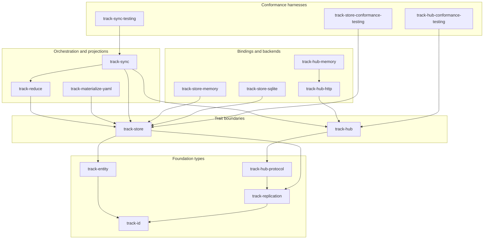

# Crate layering

This page shows how workspace crates depend on each other. Arrows follow
**Cargo dependency direction** (higher layers depend on lower layers).

## Dependency diagram



Conformance crates also depend on backends and domain crates (not every edge
is drawn). See individual [crate pages](../crates/README.md) for full dependency
lists.

## Layer summary

| Layer | Crates | Responsibility |
| --- | --- | --- |
| Foundation | `track-id`, `track-entity`, `track-replication`, `track-hub-protocol` | Shared types and wire records |
| Boundaries | `track-store`, `track-hub` | Persistence and hub service traits |
| Services | `track-reduce`, `track-materialize-yaml`, `track-sync` | Reduction, YAML projection, client sync |
| Backends / bindings | `track-store-memory`, `track-store-sqlite`, `track-hub-http`, `track-hub-memory` | Concrete store and HTTP implementations |
| Conformance | `track-store-conformance-testing`, `track-hub-conformance-testing`, `track-sync-testing` | Generic test suites for backends |

There is **no application binary crate** in the workspace yet. A future
`track-cli` (or similar) would sit above the services layer.

## Data paths

Two primary flows cross crate boundaries:

### Hub sync (push / pull)

```text
Client (track-sync)
  → HubTransport (HttpTransport)
    → track-hub-http (Axum routes)
      → HubService / HttpHubService
        → track-hub storage traits (HubLog, NodeRegistry, …)
```

Wire shapes come from `track-hub-protocol`. Event payloads use
`track-replication::EventEnvelope`.

### Node-local reduction and materialization

```text
LogStore (unreduced events)
  → track-reduce (ReductionEngine + EventReducer)
    → EntityStore, SchemaStore, … (track-store traits)
      → track-materialize-yaml (DefaultProjector)
        → YAML files on disk
```

On a production node, `track-store-sqlite` backs the store traits. Tests often
use `track-store-memory`.

## Reading order for new contributors

1. Foundation: `track-id` → `track-replication` → `track-entity`
2. Boundaries: `track-store` traits, then `track-hub` traits
3. One reference backend each: `track-store-memory`, `InMemoryHubService`
4. End-to-end: `track-sync` + `track-hub-http` + `track-hub-memory` tests

See [Types vs interfaces](./types-vs-interfaces.md) for the classification
vocabulary used across crate pages.
