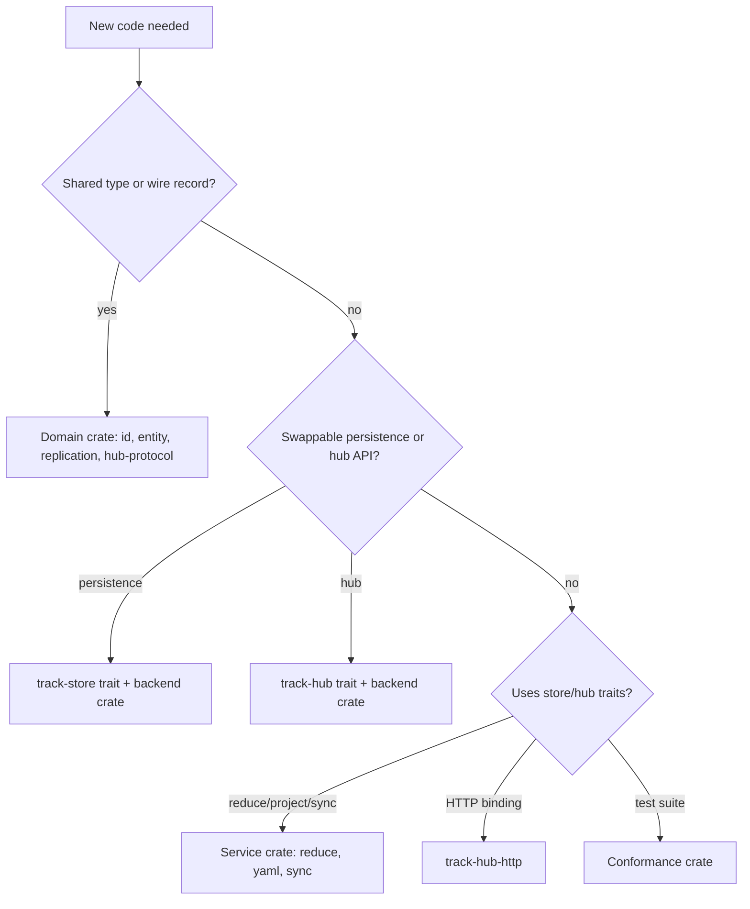

# Types vs interfaces

Track separates **shared types**, **trait boundaries**, **concrete
implementations**, and **conformance harnesses**. Use this taxonomy when
deciding where new code belongs.

## Classification summary

| Classification | Crates |
| --- | --- |
| Domain / wire types | `track-id`, `track-entity`, `track-replication`, `track-hub-protocol` |
| Trait boundaries | `track-store`, `track-hub` |
| Concrete services | `track-reduce`, `track-materialize-yaml`, `track-sync`, `track-hub-http` |
| Concrete backends | `track-store-memory`, `track-store-sqlite`, `track-hub-memory`; plus `track-hub::in_memory` |
| Conformance / integration test harnesses | `track-store-conformance-testing`, `track-hub-conformance-testing`, `track-sync-testing` |

## Domain / wire types

These crates define **concrete structs and enums** with no swappable backend:

- **`track-id`** — ULIDs, URNs, actors, stream IDs (`TrackUlid`, `EntityUrn`, …)
- **`track-entity`** — Materialized domain state (`ReducedItem`, schema types)
- **`track-replication`** — Log envelopes, HLC ordering, event payloads
- **`track-hub-protocol`** — Push/pull request and response records (ADR 0004)

They may expose small traits for extension (`EntityValidator`, `EventClassifier`)
but are not persistence or hub boundaries.

## Trait boundaries

These crates define **interfaces only** — no production backend embedded:

| Crate | Traits | Implementors live in |
| --- | --- | --- |
| `track-store` | Eight persistence traits + `FileProjector` | `track-store-memory`, `track-store-sqlite`, future backends |
| `track-hub` | `HubService`, `HubLog`, `NodeRegistry`, `Authorizer`, … | `track-hub::in_memory`, future durable hub crates |

Adding SQLite, Postgres, or HTTP logic **inside** these crates would blur the
contract boundary ADRs 0003, 0004, and 0007 establish.

## Concrete services

Logic that **uses** traits but does not define the primary swappable boundary:

- **`track-reduce`** — Deterministic event reducers over `track-store` traits
- **`track-materialize-yaml`** — YAML projection reading `EntityStore`
- **`track-sync`** — Client push/pull orchestration via `HubTransport`
- **`track-hub-http`** — Axum binding for any `HttpHubService` implementation

## Concrete backends

Replaceable implementations of trait boundaries:

| Backend | Implements | Durability |
| --- | --- | --- |
| `track-store-memory` | All eight `track-store` traits | Ephemeral |
| `track-store-sqlite` | All eight traits on `TrackSqliteStore` | Durable |
| `InMemoryHubService` (`track-hub::in_memory`) | `HubService`, hub storage traits | Ephemeral |
| `track-hub-http` + `track-hub-memory` | HTTP server wrapping `InMemoryHubService` | Ephemeral |

No **durable hub backend** exists in the repo yet (`DurableHub` /
`DurableHubFixture` are reserved for a future crate such as `track-hub-postgres`).

## Conformance harnesses

Not production APIs — generic test suites backends must pass:

| Crate | Suite | Validates |
| --- | --- | --- |
| `track-store-conformance-testing` | STORE-CONF | Store trait contracts |
| `track-sync-testing` | HUB_SYNC | Multi-node sync protocol |
| `track-hub-conformance-testing` | HUB-CONF | Hub restart durability |

Fixture traits (`StoreConformanceFixture`, `EphemeralHubFixture`, …) belong
here; each backend crate implements them in its own `tests/` targets.

## Decision guide

## Related pages

- [Trait inventory](../interfaces/README.md)
- [Implement a new store backend](../guides/new-store-backend.md)
- [Implement a new hub service](../guides/new-hub-implementation.md)
