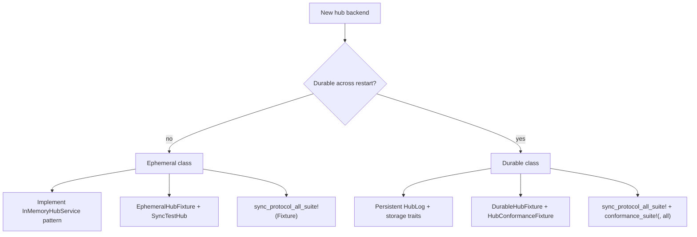

# Implement a new hub service

This guide covers adding a hub backend — ephemeral (protocol testing) or
durable (production-capable) — that implements `track-hub` traits and passes
the applicable conformance suites from [ADR 0005](../../adr/0005-hub-implementation-conformance.md).

Reference implementations:

- **Ephemeral:** `InMemoryHubService` in [`track-hub::in_memory`](../../crates/track-hub/src/in_memory/)
- **HTTP wiring:** [`TestHubHandle`](../../crates/track-hub-memory/src/test_hub_handle.rs)
- **Fixture adapter:** [`MemoryHubFixture`](../../crates/track-sync-testing/src/fixtures/memory.rs)

## Decision tree



## Shared steps (all backends)

### 1. Implement hub storage traits

A hub composes four storage traits (see `track-hub::in_memory`):

| Trait | Responsibility |
| --- | --- |
| `HubLog` | Append-only durable log; hub offset assignment |
| `NodeRegistry` | Registered nodes per workspace |
| `CursorReports` | Replica cursor sets for compaction |
| `SnapshotCatalog` | Published project snapshots |

Replace in-memory `Mutex<InMemory*>` types with your persistent storage while
preserving trait method semantics.

### 2. Implement `HubService`

The core async API (`push_events`, `pull_events`, `report_cursors`) is defined
in [`hub_service.rs`](../../crates/track-hub/src/hub_service.rs).

`InMemoryHubService` delegates to shared modules:

- [`push_service.rs`](../../crates/track-hub/src/push_service.rs)
- [`pull_service.rs`](../../crates/track-hub/src/pull_service.rs)

Reuse this logic where possible rather than reimplementing protocol rules.

### 3. Implement `HttpHubService`

HTTP routes require the extension trait in `track-hub-http`:

```rust
#[async_trait]
pub trait HttpHubService: HubService {
    async fn latest_project_snapshot(&self, project_uuid: TrackUlid)
        -> Option<ProjectSnapshot>;
}
```

`InMemoryHubService` implements this by reading `SnapshotCatalog`.

### 4. Bind HTTP

Wrap the service and serve via `HubHttpServer`:

```rust
let hub: Arc<dyn HttpHubService> = Arc::new(my_hub_service);
let server = HubHttpServer::bind(addr, workspace_uuid, hub).await?;
```

See [`TestHubHandle::start_with`](../../crates/track-hub-memory/src/test_hub_handle.rs)
for the full loopback pattern.

## Ephemeral path (protocol testing)

For CI-friendly hubs that do not survive restart:

### 5. Implement sync test fixture traits

| Trait | Purpose |
| --- | --- |
| `SyncTestHub` | `base_url`, `workspace_uuid`, `register_node`, `shutdown` |
| `EphemeralHub` | Marker trait (blanket impl) |
| `HubAdmin` | Compaction/snapshot scenarios (Groups E, L) |
| `AckTestHub` | Push ack fault injection (Group J) — optional |

Follow [`MemorySyncTestHub`](../../crates/track-sync-testing/src/fixtures/memory.rs).

### 6. Implement `EphemeralHubFixture`

Provides `start` and `start_with_actor_allowlist` returning your `SyncTestHub`
implementation.

### 7. Wire HUB_SYNC suite

In `tests/hub_sync_*.rs` (or one combined test file):

```rust
track_sync_testing::sync_protocol_all_suite!(MyHubFixture);
```

This expands into the full HUB_SYNC catalog exercised against real HTTP.

## Durable path (production-capable)

For hubs that must survive process restart:

### 5. Implement `DurableHub` and `DurableHubFixture`

| Method | Requirement |
| --- | --- |
| `provision_storage` | Isolated directory for one test case |
| `start_with_storage` | Bind HTTP; load or create on-disk state |
| `stop_graceful` | Clean shutdown; all durable commits persisted |
| `stop_interrupt` | Simulated crash; no extra durable commits |

See [ADR 0005 §Lifecycle contract](../../adr/0005-hub-implementation-conformance.md).

### 6. Implement `HubConformanceFixture`

Parallel to `DurableHubFixture` for HUB-CONF cases:

- `provision_storage`, `start`, `stop_graceful`, `stop_interrupt`
- Running handle implements `HubConformanceHandle`
- Admin cases need `HubConformanceAdmin` (extends handle with compaction and
  snapshot ops)

Defined in [`lifecycle.rs`](../../crates/track-hub-conformance-testing/src/lifecycle.rs).

### 7. Wire both suites

```rust
// Protocol — same bar as track-hub-memory
track_sync_testing::sync_protocol_all_suite!(PostgresHubFixture);

// Durability — HUB-CONF restart cases
track_hub_conformance_testing::conformance_suite!(PostgresHubFixture, all);
```

A durable hub must pass **both** HUB_SYNC and HUB-CONF.

## Auth

Inject authorization via `Authorizer`:

- `AllowAllAuthorizer` — local dev and most tests
- `ActorAllowlistAuthorizer` — HUB_SYNC-130/131 scenarios
- `SharedAuthorizer` — wrap any `Arc<dyn Authorizer>`

Construct with `InMemoryHubService::with_authorizer` or equivalent in your
backend.

## Release checklist

- [ ] All applicable HUB_SYNC suites pass
- [ ] Durable backends: HUB-CONF 001–008 pass
- [ ] HTTP routes match ADR 0004 (version headers, NDJSON push)
- [ ] Update [Hub traits](../interfaces/hub.md) and crate page
- [ ] Document durability class and any skipped suites (for example if
  `AckTestHub` is not implemented)

## Related

- [Hub traits](../interfaces/hub.md)
- [track-hub crate](../crates/track-hub.md)
- [track-hub-conformance-testing](../crates/track-hub-conformance-testing.md)
