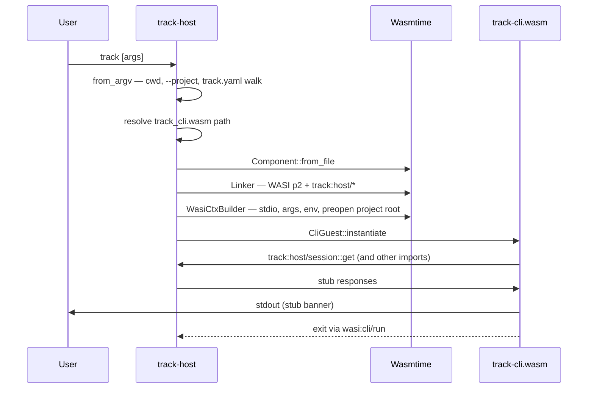

# ADR 0001 implementation plan

> **Branch:** `feat/adr-0001-implementation-plan`  
> **Purpose:** Validate [ADR 0001](../adr/0001-implementation-runtime.md) feasibility and scaffold the Rust workspace that implements it.  
> **Outcome:** Feasible — a `track-host` binary loads a `wasm32-wasip2` `track-cli` component, links WASI Preview 2, and stubs every `track:*` import from [ADR 0002](../adr/0002-host-guest-wit-interfaces.md).

**Date:** 2026-06-07

## Validation summary

A minimal end-to-end path was built and exercised:

1. `cargo build -p track-cli --target wasm32-wasip2` produces `track_cli.wasm`.
2. `cargo run -p track-host` (or `target/debug/track`) loads that component via Wasmtime 45.
3. The guest calls `wasi:cli/run`, imports `track:host/*` interfaces, and prints bootstrap metadata to stdout.

This confirms the core ADR 0001 bet: **Rust + Wasmtime + WASIp2 + Component Model + custom WIT** is a viable foundation for Track’s CLI.

### Feasibility findings

| Topic | Finding |
|-------|---------|
| Toolchain | Rust **1.95.0** with `wasm32-wasip2` target builds components with `wit-bindgen` 0.57. |
| Host runtime | Wasmtime **45** + `wasmtime-wasi` p2 bindings link standard WASI and custom imports. |
| Bindgen direction | Host bindgen must target the **`cli-guest`** world (guest imports → host implements). |
| `add_to_linker` | With `require_store_data_send: true`, use `CliGuest::add_to_linker::<HostState, HasSelf<HostState>>`. |
| WIT layout | `wit-bindgen` requires **one package per directory**; all `track:*` interfaces live in `package track:host@0.1.0`. |
| WASI in WIT | Guest world exports only `wasi:cli/run@0.2.3`; other WASI imports come from the target + host linker. |
| Reserved WIT names | Avoid `list`, `flags`, `status` as function/record/field names (parser/bindgen conflicts). |
| `project-lock` | Resource-based lock deferred; feasibility stub uses `acquire` / `release` functions. |
| `locations` | Feasibility stub returns `guest-path` strings instead of `wasi:filesystem` descriptors. |
| `offline-queue` | Timestamps as RFC3339 strings instead of `wasi:clocks` datetime types in the stub. |

## Repository layout

```
track/
├── rust-toolchain.toml          # Pinned Rust 1.95.0 + wasm32-wasip2
├── Cargo.toml                   # Workspace root
├── wit/
│   ├── deps.toml / deps.lock    # wit-deps manifest + lock (committed)
│   ├── deps/                    # Generated WASI WIT (gitignored; see track-wit-deps)
│   └── track/                   # package track:host@0.1.0
│       ├── world.wit            # cli-guest + track-host worlds
│       ├── session.wit
│       ├── capabilities.wit
│       ├── locations.wit
│       ├── auth.wit
│       ├── user-config.wit
│       ├── project-lock.wit
│       ├── project-state.wit
│       ├── offline-queue.wit
│       └── registry.wit
└── crates/
    ├── track-wit-deps/          # build.rs: wit-deps lock_sync → wit/deps/
    ├── track-host/              # Native binary `track`
    ├── track-host-wit/        # Wasmtime bindgen for host implementations
    └── track-cli/               # wasm32-wasip2 guest component
```

## Crates

### `track-host`

Native launcher embedding Wasmtime. Responsibilities in the feasibility stub:

| Module | Role |
|--------|------|
| `bootstrap.rs` | Parse argv; discover project root via upward `track.yaml` walk (SRD §3.2.1); resolve component path (`TRACK_CLI_COMPONENT` or `target/wasm32-wasip2/debug/track_cli.wasm`). |
| `host_impl.rs` | Stub implementations of all `track:host/*` host traits on `HostState` (also holds `WasiCtx` + `ResourceTable`). |
| `main.rs` | Engine setup, linker (`wasmtime_wasi::p2::add_to_linker_sync` + `CliGuest::add_to_linker`), preopen project root, instantiate, call `wasi:cli/run`. |

### `track-host-wit`

Thin crate wrapping `wasmtime::component::bindgen!` against the `cli-guest` world:

```rust
wasmtime::component::bindgen!({
    world: "cli-guest",
    path: "../../wit/track",
    require_store_data_send: true,
    with: { "wasi": wasmtime_wasi::p2::bindings },
});
```

Exports `CliGuest` (instantiate, `add_to_linker`, `wasi_cli_run`) and `track::host::*` host trait modules.

### `track-cli`

Guest component (`crate-type = ["cdylib"]`). Uses `wit_bindgen::generate!` on `cli-guest`. Exports `wasi:cli/run`; the stub prints session/capabilities/locations and optionally exercises other imports when invoked as `track interfaces`.

## Bootstrap flow (current stub)



Not yet implemented (ADR 0001 Phase 3–4): read `tool.version` from `track.yaml`, component registry fetch, capability narrowing per command, async host functions.

## Build and run

Prerequisites: Rust **1.95.0** (via `rust-toolchain.toml`).

```bash
# Build guest component
cargo build -p track-cli --target wasm32-wasip2

# Build and run host (auto-resolves component from target/)
cargo run -p track-host

# Exercise all WIT import stubs
cargo run -p track-host -- interfaces

# Override component path
TRACK_CLI_COMPONENT=target/wasm32-wasip2/debug/track_cli.wasm cargo run -p track-host
```

Release builds:

```bash
cargo build -p track-cli --target wasm32-wasip2 --release
cargo build -p track-host --release
```

## Implementation phases

### Phase 0 — Feasibility scaffold (this branch) ✅

- [x] Workspace, toolchain pin, three crates
- [x] WIT package `track:host@0.1.0` with `cli-guest` / `track-host` worlds
- [x] Host stub implementations for all ADR 0002 interfaces
- [x] Guest stub calling imports and exporting `wasi:cli/run`
- [x] End-to-end host → guest invocation

### Phase 1 — Bootstrap parity ✅

- [x] Parse global flags into `track:session` (`--json`, `--dry-run`, `--project`, `--tool-version`, …)
- [x] Read `tool.version` from `track.yaml` when project in scope
- [x] Implement `track:registry` — local cache under user-cache `components/`, semver + digest lookup
- [x] Host errors before guest load when project required but not found
- [x] Map all six storage areas to real paths and WASI preopens (narrow, per ADR 0002)

### Phase 2 — Real host implementations ✅

- [x] `user-config` — read/write `config.json` under user-config area (0600 perms, validation)
- [x] `auth` — resolve workspace tokens from config (no env leakage)
- [x] `project-state` — read/write `.track/state.json` with advisory `project-lock`
- [x] `offline-queue` — persist mutation queue under user-state (`offline-queue/<slug>.json`)
- [x] `capabilities` — per-command policy (network allowlist from `track.yaml` workspace, area visibility)
- [ ] Resource-based `project-lock` via Wasmtime resources (file advisory lock implemented on function API)

### Phase 3 — CLI logic in guest ✅

- [x] Command router (`version`, `help`, `auth`, `schema validate`, `interfaces`; stubs for remaining SRD commands)
- [ ] Schema validation, materialization, hub HTTP client (via `wasi:sockets` or host-mediated HTTP — deferred post-phase-3)
- [x] JSON output mode (`--json`), stable exit codes (non-zero on error/unknown command)
- [x] Shared `track-types` crate for JSON response shapes

### Phase 4 — Distribution and CI

- [ ] GitHub release pipeline: `track-host` matrix (linux/macOS/windows) + `track-cli.wasm` artifacts
- [ ] Golden integration test: fixture project + pinned `tool.version`
- [ ] Capability test: guest cannot read outside preopens
- [ ] Document air-gapped vendoring (`.track/components/` vs user-cache)

### Phase 5 — Developer ergonomics

- [ ] `cargo xtask` or Makefile: build guest + host in one command
- [ ] Optional fast path: `TRACK_DEV_NATIVE=1` for native guest debugging (ADR 0001 open question #4)
- [ ] Cross-component logging / tracing across host/guest boundary

## ADR / SRD follow-ups

These items should be reflected in ADR 0002 or SRD updates after this plan is reviewed:

1. **Single WIT package** — `track:host@0.1.0` consolidates interfaces (not separate `track:session`, `track:config`, … packages as sketched in ADR 0002 prose).
2. **Renamed WIT symbols** — `list-workspaces`, `list-queued`, `get-status`, `capability-flags`, `parsed-flags`, `queue-status`.
3. **`project-lock` simplification** — function-based lock in v0.1 stub; resource lock noted as Phase 2.
4. **`track.yaml` `tool` block** — finalize schema in SRD §8 (ADR 0001 illustrative YAML).
5. **ADR 0001 status** — move to `Accepted` once this plan and scaffold are merged.

## Dependencies (pinned)

| Crate / tool | Version | Notes |
|--------------|---------|-------|
| Rust | 1.95.0 | `rust-toolchain.toml` |
| wasmtime | 45 | Component model + WASI p2 |
| wasmtime-wasi | 45 | `p2::add_to_linker_sync`, `WasiCtxBuilder` |
| wit-bindgen | 0.57 | Guest generate + host bindgen |
| WASI WIT | 0.2.3 | `wit-deps` via `crates/track-wit-deps/build.rs` → `wit/deps/` |

## Risks and mitigations

| Risk | Mitigation |
|------|------------|
| WASIp2 toolchain churn | `rust-toolchain.toml` + lockfile; CI checks both targets |
| Bindgen / WIT naming pitfalls | Document reserved names; add `wit` parse check in CI |
| Cold-start latency | Cache compiled components; release-mode guest in CI |
| Debug across host/guest | Structured logging in host stubs; guest `RUST_BACKTRACE` via wasm |
| Windows path semantics | Phase 4 matrix job; explicit area mapping tests |

## References

- [ADR 0001 — Implementation runtime](../adr/0001-implementation-runtime.md)
- [ADR 0002 — Host–guest WIT interfaces](../adr/0002-host-guest-wit-interfaces.md)
- [SRD §3.2 — Project root discovery](../SRD.md)
- [Wasmtime WASIp2 example](https://docs.wasmtime.dev/examples-wasip2.html)
- WIT sources: [`wit/track/`](../../wit/track/)
