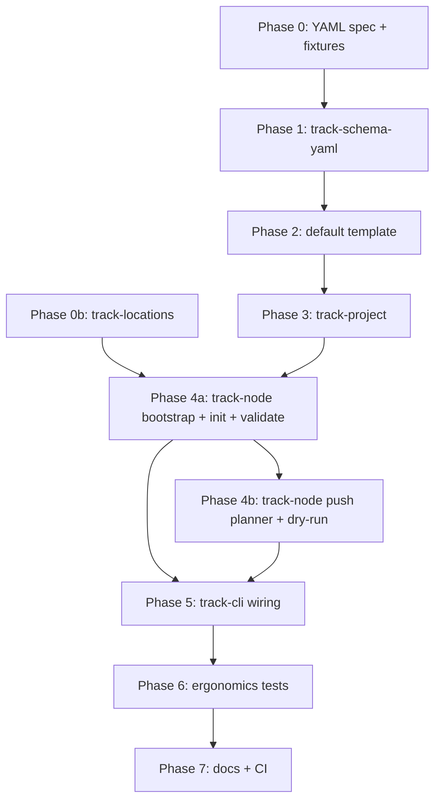

# CLI M0 — `init`, `schema validate`, `push --dry-run`

> **Status:** Draft\
> **Sources:** [PRD](../PRD.md), [SRD](../SRD.md) §3–§4, §7.1–§7.2, §9\
> **Builds on:** [ADR 0003 domain plan](./adr-0003-domain-model-implementation-plan.md),
> [ADR 0004 hub sync plan](./adr-0004-hub-sync-implementation-plan.md)

Native CLI milestone focused on **project bootstrapping ergonomics**, **offline
schema validation**, and **push planning visibility** (`track push --dry-run` with
debug logging of the full hub payload). Maps to SRD requirements **P-1**, **P-3**,
**P-2** (planning slice only), and milestone **M2** (partial).

Plane Compose equivalents (SRD §1.1): `plane init` → `track init`, `plane schema
validate` → `track schema validate`, `plane push --dry-run` → `track push
--dry-run`.

ADR 0001/0002 (WASM host/guest) remain **deferred**; this plan uses a native
binary.

---

## Goals

1. **Validate bootstrapping ergonomics** — standalone vs repo-embedded `track/`
   layout, project discovery, agent-friendly JSON output.
2. **`track init`** — lay down the built-in **`default`** schema template with a
   client-generated `project_uuid`.
3. **`track schema validate`** — offline structural and cross-reference checks on
   `track.yaml` and `schema/*.yaml` (no network).
4. **`track push --dry-run`** — compute the replication events that would be sent
   to the hub; with debug logging enabled, emit the **full planned payload** to
   stderr via structured `tracing` (no hub I/O).

**Out of scope for this milestone:** live push/pull, hub auth, SQLite reduction
store bootstrap, work-item CRUD, Git URL templates, `software` template.

---

## Crate layout

```text
track-id ── track-entity ── track-schema-yaml ──┐
         │                                      ├── track-locations ── track-project ── track-node ── track-cli (bin: track)
track-replication ── track-hub-protocol ── track-sync ──┘
track-materialize-yaml (shared path helpers)
```

| Crate | Role |
| --- | --- |
| **`track-locations`** | Six storage buckets (user + project config/state/cache); platform defaults; test overrides |
| **`track-schema-yaml`** | Load and validate compose-style `schema/*.yaml`; compile to `CanonicalSchema` |
| **`track-project`** | `track.yaml` manifest, project-root discovery, template install, project bucket layout |
| **`track-node`** | **Command logic** — bootstrap, init, schema validate, push planning; no CLI parsing |
| **`track-cli`** | **`track` binary** — `clap` argv, log subscriber, per-command spans; delegates to `track-node` |

`track-node` is the library surface for future non-CLI UX (TUI, MCP server, tests
that invoke commands without spawning a process). **`track-cli` must stay thin.**

### Dependency rules

| Crate | May depend on | Must not depend on |
| --- | --- | --- |
| `track-locations` | `track-id`, `dirs` (or equivalent) | CLI, hub, YAML |
| `track-schema-yaml` | `track-entity`, `track-id`, `serde_yaml` | `track-cli`, HTTP, SQLite |
| `track-project` | `track-schema-yaml`, `track-id`, `track-locations`, `track-materialize-yaml` (paths only) | `track-cli`, hub I/O |
| `track-node` | `track-locations`, `track-project`, `track-schema-yaml`, `track-sync`, `track-replication`, `track-hub-protocol` | `clap`, `tracing-subscriber` |
| `track-cli` | `track-node`, `clap`, `anyhow`, `tracing`, `tracing-subscriber` | direct domain logic |

Register `track-locations`, `track-schema-yaml`, `track-project`, `track-node`,
and `track-cli` in root `Cargo.toml` `members`.

---

## Error handling

Use **`thiserror`** for typed, library-local errors inside lower crates and
`track-node`:

```rust
// track-node — example boundary
#[derive(Debug, thiserror::Error)]
pub enum NodeError {
    #[error("project discovery failed")]
    Project(#[from] track_project::ProjectError),
    #[error("schema validation failed")]
    Schema(#[from] track_schema_yaml::SchemaError),
    #[error("push planning failed")]
    PushPlan(#[from] PushPlanError),
}
```

Use **`anyhow`** only at the **`track-cli`** boundary for context chains and
user-facing top-level messages:

```rust
fn run() -> anyhow::Result<ExitCode> {
    track_node::init(args)
        .context("failed to initialize project")?;
}
```

Map `NodeError` variants to process exit codes (§ Exit codes) without leaking
internal details unless `--verbose` / `--debug`.

---

## Storage locations (`track-locations`)

All application logic resolves paths through **`track-locations`** — never hard-
code `~/.config/track` or `.track/` in command handlers. Aligns with ADR 0002
[`wit/track/locations.wit`](../../wit/track/locations.wit) bucket names; native
CLI uses the same six-bucket model without WIT.

### Six buckets

| Bucket | Default resolution | Contents (M0) |
| --- | --- | --- |
| **user-config** | Platform config dir + `track/` | `config.json` — `default_actor`, workspace registry (empty initially) |
| **user-state** | Platform state dir + `track/` | `node.json` — stable `node_uuid` for this machine |
| **user-cache** | Platform cache dir + `track/` | Reserved (empty dir created); fetched templates later |
| **project-config** | `<project-root>/` | `track.yaml`, `schema/`, `work/` |
| **project-state** | `<project-root>/.track/` | `state.json`, `state.lock` |
| **project-cache** | `<project-root>/.track/cache/` | Reserved (empty dir created); index DB later |

### Platform defaults

Use the [`dirs`](https://docs.rs/dirs) crate (or equivalent) for OS-appropriate
base paths:

| OS | user-config | user-state | user-cache |
| --- | --- | --- | --- |
| Linux (XDG) | `$XDG_CONFIG_HOME/track` or `~/.config/track` | `$XDG_STATE_HOME/track` or `~/.local/state/track` | `$XDG_CACHE_HOME/track` or `~/.cache/track` |
| macOS | `~/Library/Application Support/track` (via `ProjectDirs` / config dir) | `~/Library/Application Support/track/state` or equivalent state path | `~/Library/Caches/track` |
| Windows | `%APPDATA%\track` | `%LOCALAPPDATA%\track\state` | `%LOCALAPPDATA%\track\cache` |

Exact path helpers live in one module (`platform_paths.rs`); unit-test the mapping
with injected base dirs.

### Public API

```rust
pub struct UserLocations {
    pub config: PathBuf,   // user-config root
    pub state: PathBuf,    // user-state root
    pub cache: PathBuf,    // user-cache root
}

pub struct ProjectLocations {
    pub config: PathBuf,   // project-config root (= project root)
    pub state: PathBuf,    // project-state root (.track/)
    pub cache: PathBuf,    // project-cache root (.track/cache/)
}

pub struct Locations {
    pub user: UserLocations,
    pub project: Option<ProjectLocations>,
}

/// Override any bucket root — used by tests and future `--data-dir` flags.
pub struct LocationsOverride {
    pub user_config: Option<PathBuf>,
    pub user_state: Option<PathBuf>,
    pub user_cache: Option<PathBuf>,
}

pub fn resolve_user_locations(overrides: &LocationsOverride) -> Result<UserLocations, LocationError>;
pub fn resolve_project_locations(project_root: &Path) -> ProjectLocations;
pub fn ensure_bucket_dirs(loc: &Locations) -> Result<(), LocationError>;
```

**Test overrides (required):**

1. **Programmatic** — `LocationsOverride` passed through `BootstrapRequest` /
   `NodeTestContext` (preferred in unit/integration tests).
2. **Environment** — optional escape hatch for `assert_cmd` subprocess tests:

| Variable | Overrides |
| --- | --- |
| `TRACK_USER_CONFIG_DIR` | user-config |
| `TRACK_USER_STATE_DIR` | user-state |
| `TRACK_USER_CACHE_DIR` | user-cache |

Project buckets inherit `--project` / discovery; tests point at temp project
roots directly (no env var required).

### First-run user initialization

During **`track.bootstrap`**, before project search, call
`track_locations::ensure_user_identity(&user_locations)`:

1. Create user-config, user-state, and user-cache directories if missing.
2. If **`user-state/node.json`** absent → generate `node_uuid` (`TrackUlid::new()`),
   write atomically.
3. If **`user-config/config.json`** absent → write defaults:
   - `default_actor`: `user:{os_username}` (fallback `user:unknown`)
   - `workspaces`: `{}`
4. If files exist → load and validate; do not regenerate IDs.

Log at **`INFO`** on first creation (`created user config`, `assigned node_uuid`,
`default_actor`); at **`DEBUG`** on subsequent runs when loading existing files.

Record on **`track.bootstrap`** span: `node_uuid`, `default_actor`, `user_config`.

`BootstrapOutcome` carries `Locations { user, project }` and loaded
`UserIdentity { node_uuid, default_actor }` for push planning and future hub
I/O. Push dry-run envelopes use the persisted **`node_uuid`** and
**`default_actor`**, not ephemeral values.

**`config.json` (M0 minimum):**

```json
{
  "default_actor": "user:greg",
  "workspaces": {}
}
```

**`node.json`:**

```json
{
  "node_uuid": "01JHM8X9K2Q4N0"
}
```

---

## Logging and observability

Foundation: **`tracing`** in `track-node` (and lower crates where useful);
**`tracing-subscriber`** configured once in `track-cli` writing to **stderr**
(human stdout stays clean for `--json` command output).

### CLI log level controls

Global flags on the root `clap` command:

| Flag | `tracing` level |
| --- | --- |
| *(default)* | `WARN` |
| `-v` / `--verbose` | `INFO` |
| `--debug` | `DEBUG` |
| `--trace` | `TRACE` (optional; hidden or documented for deep diagnostics) |

Implementation sketch:

```rust
fn init_tracing(verbose: bool, debug: bool, trace: bool) {
    let filter = if trace {
        "trace"
    } else if debug {
        "debug"
    } else if verbose {
        "info"
    } else {
        "warn"
    };
    tracing_subscriber::fmt()
        .with_writer(std::io::stderr)
        .with_env_filter(filter)
        .init();
}
```

Respect `RUST_LOG` as an override when set (document in `--help`).

### Span hierarchy

Every process invocation uses two nested spans. **`track.bootstrap`** wraps
startup and project resolution; each command uses a **unique span name** mirroring
its CLI path (dot-separated).

```text
track.bootstrap              # startup + project search / target resolution
├── track.init               # track init …
├── track.schema.validate    # track schema validate
└── track.push               # track push …
```

Create **`track.bootstrap` first** in `track-cli` immediately after
`init_tracing`, before dispatching to `track-node`. Nest the command-specific span
as a child inside it. **Do not** use a shared `track.command` span with a
`command` field — the span name identifies the command.

### Bootstrap span (`track.bootstrap`)

Covers process startup and project location — everything that happens before
command logic runs.

**Created in:** `track-cli` `main.rs`, after `clap` parse and `init_tracing`.

**Initial fields:**

| Field | Source |
| --- | --- |
| `cwd` | `std::env::current_dir()` |
| `explicit_project` | `--project PATH` if set (empty otherwise) |
| `log_level` | Resolved filter (`warn` / `info` / `debug` / `trace`) |
| `node_uuid` | From user-state after first-run init (recorded when known) |
| `default_actor` | From user-config (recorded when known) |
| `user_config` | user-config bucket path (recorded after resolve) |

**Startup events** (inside the span, before project dispatch):

1. Resolve user locations (respecting `LocationsOverride` / env vars).
2. **`ensure_user_identity`** — create user buckets; persist or load `node_uuid`
   and `default_actor` (see § Storage locations).
3. Log startup summary.

```rust
tracing::info!(
    cwd = %cwd.display(),
    explicit_project = explicit_project.as_deref().unwrap_or(""),
    log_level = %log_level,
    node_uuid = %identity.node_uuid,
    default_actor = %identity.default_actor,
    user_config = %locations.user.config.display(),
    "track startup"
);
```

**Project search / resolution** runs next in the same span via
`track_node::bootstrap(BootstrapRequest)` (or equivalent), which delegates to
`track-project::discover_project_root` for commands that require an existing
project, or `track-project::resolve_init_target` for `init`:

| Step | Log level | Example message |
| --- | --- | --- |
| Explicit `--project` set | `DEBUG` | `using explicit project root: ./track` |
| Walk-up: checking directory | `DEBUG` | `searching for track.yaml: /path/to/dir` |
| Walk-up: found | `INFO` | `found project root: /path/to/track` |
| Walk-up: exhausted | `DEBUG` | `no track.yaml found walking up from cwd` |
| Init layout heuristic | `DEBUG` | `repo root detected; default init target: ./track` |

Record resolved paths on the span when known:

| Field | When recorded |
| --- | --- |
| `project_root` | After discovery or init target resolution |
| `discovery_method` | `explicit` \| `walk_up` \| `init_target` \| `none` |

```rust
let bootstrap = tracing::info_span!(
    "track.bootstrap",
    cwd = %cwd.display(),
    explicit_project = tracing::field::Empty,
    log_level = %log_level,
    project_root = tracing::field::Empty,
    discovery_method = tracing::field::Empty,
);
let _bootstrap = bootstrap.enter();

tracing::info!("track startup");

let resolved = track_node::bootstrap(BootstrapRequest {
    cwd: &cwd,
    explicit_project: cli.project.as_deref(),
    needs_existing_project: !matches!(cli.command, Command::Init(_)),
})?;

bootstrap.record("explicit_project", explicit_project_display);
bootstrap.record("project_root", resolved.root.display().to_string());
bootstrap.record("discovery_method", resolved.method.as_str());
```

With **`--debug`**, the walk-up emits one `DEBUG` line per directory checked
(useful for diagnosing “wrong project picked up” reports). With **`--trace`**,
also log filesystem stat outcomes and heuristic inputs (repo-root markers seen).

`init` skips walk-up discovery but still runs target resolution under
`track.bootstrap` (explicit path, layout heuristic, create-if-needed).

### Per-command spans

Nested **inside** `track.bootstrap`. Each command gets a **distinct span name**
in `track-cli` before calling the handler:

| CLI command | Span name |
| --- | --- |
| `track init` | `track.init` |
| `track schema validate` | `track.schema.validate` |
| `track push` | `track.push` |

Future commands follow the same rule: span name = `track.` + dot-separated
subcommand path (e.g. `track.issue.create`, `track.hub.poll`).

**`track init` example:**

```rust
let init = tracing::info_span!(
    "track.init",
    key = %key,
    template = %template,
    force = force,
);
let _init = init.enter();
track_node::init(InitRequest { … })?;
```

**`track schema validate` example:**

```rust
let validate = tracing::info_span!("track.schema.validate");
let _validate = validate.enter();
track_node::schema_validate(…)?;
```

**`track push` example:**

```rust
let push = tracing::info_span!(
    "track.push",
    dry_run = dry_run,
    schema_only = schema_only,
    work_only = work_only,
);
let _push = push.enter();
track_node::push(…)?;
```

Span fields per command (in addition to the span name):

| Span name | Fields |
| --- | --- |
| `track.init` | `key`, `template`, `force`, `standalone` |
| `track.schema.validate` | *(none required at M0)* |
| `track.push` | `dry_run`, `schema_only`, `work_only` |

`project_root` lives on the parent **`track.bootstrap`** span only (single
source of truth). Command handlers read the resolved root from
`BootstrapOutcome`; they do not re-run discovery.

Lower layers emit `debug!` / `trace!` events inside the active command span
(file reads, planner steps, per-event envelope details).

---

## Phase 0 — Schema YAML format spec + fixtures

SRD §2.5–§2.8 and §3.4 describe semantics but not full file examples for every
`schema/*.yaml` file. Before coding:

1. Add **SRD §3.4.1 Schema file formats** (or appendix) with one complete example
   per file.
2. Create golden fixtures:

```text
crates/track-schema-yaml/tests/fixtures/
├── valid/default/          # matches templates/default/
└── invalid/
    ├── workflow_unknown_state/
    ├── duplicate_default_state/
    └── manifest_bad_default_type/
```

---

## Phase 1 — `track-schema-yaml`

### Loader

- `StatesDocument`, `LabelsDocument`, `WorkflowsDocument`, `TypesDocument`,
  `FeaturesDocument` — one type per source file.
- `SchemaBundle::load(project_root)` — reads all five under `schema/`.
- `SchemaValidationReport` — structured errors: `{ file, path, code, message }`.

### Validation (offline)

Dependency order (SRD §3.4, Appendix A):

1. YAML syntax.
2. Per-file structure (state groups, colors, field kinds, unique label names).
3. Cross-references (workflow → states/types; transitions → states; manifest
   defaults → types/workflows).
4. Global invariants (exactly one default state; no dangling type references).
5. Optional: compile `SchemaBundle` → `CanonicalSchema` for parity with
   `track-entity` / reducers.

Public API:

```rust
pub fn load_schema_bundle(root: &Path) -> Result<SchemaBundle, SchemaError>;
pub fn validate_schema_bundle(
    bundle: &SchemaBundle,
    manifest: &ProjectManifest,
) -> SchemaValidationReport;
```

Errors use **`thiserror`** (`SchemaError`, `LoadError`, validation `code` enums).

---

## Phase 2 — Built-in `default` template

Ship `templates/default/` in-repo (embedded at compile time):

| File | Content |
| --- | --- |
| `states.yaml` | Backlog, Todo (default), In Progress, Done, Cancelled |
| `workflows.yaml` | `default` workflow for `Task`; no `transitions` block |
| `types.yaml` | Single `Task` type |
| `labels.yaml` | Empty or one example label |
| `features.yaml` | SRD §2.9 feature toggles with conservative defaults |
| `track.yaml.tmpl` | Placeholders: `{key}`, `{name}`, `{project_uuid}`, `{workspace}` |

Template resolution (v0):

| `--template` | Behavior |
| --- | --- |
| `default` | Embedded built-in |
| Local directory path | Copy tree |
| Git URL | Error: not yet supported |

---

## Phase 3 — `track-project`

Filesystem and manifest primitives (no CLI, no tracing subscriber):

- `ProjectManifest` — deserialize SRD §3.3 `track.yaml`.
- `discover_project_root(cwd, explicit)` — SRD §3.2.1 walk-up / `--project`;
  emits **`DEBUG`** per directory checked and **`INFO`** on success (inside an
  active `track.bootstrap` span).
- `resolve_init_target(cwd, explicit, layout)` — init target path + layout
  heuristic; same logging conventions.
- `init_project(options) -> InitOutcome` — copy template, generate
  `project_uuid`, create project buckets (`schema/`, `work/`, `.track/state.json`,
  `.track/cache/`, `.gitignore`) via `track-locations`.
- **Layout heuristic:** when CWD looks like an app repo root and no in-tree
  project, default target `./track/` (SRD §3.2.2); add `--standalone` to force
  `./`.
- **`--force` on `track init`** (see § Resolved decisions):

| Condition | Behavior |
| --- | --- |
| `track.yaml` absent | Normal init |
| `track.yaml` present, no `--force` | Error: project already exists |
| `track.yaml` present, `--force` | Re-apply template: overwrite `track.yaml` (schema section), replace `schema/`, reset `.track/state.json`, recreate empty `work/` subtrees; **preserve existing `project_uuid`** when readable from current manifest |

After init, run `validate_schema_bundle` internally; init must never leave a
broken tree.

---

## Phase 4 — `track-node`

Command handlers — the library API future UIs call directly.

### Bootstrap

`track_node::bootstrap(BootstrapRequest) -> BootstrapOutcome` runs during
`track.bootstrap`:

1. Resolve user locations + **`ensure_user_identity`** (first-run init).
2. Resolve project root (explicit path, walk-up, or init target).
3. Attach **`ProjectLocations`** when a project root is known.

Returns `locations`, `user_identity`, `project_root`, `discovery_method`, and
optional manifest load for downstream commands.

### Types

```rust
pub struct BootstrapOutcome {
    pub locations: Locations,
    pub user_identity: UserIdentity,
    pub project_root: Option<PathBuf>,
    pub discovery_method: DiscoveryMethod,
}

pub struct UserIdentity {
    pub node_uuid: NodeUuid,
    pub default_actor: Actor,
}

pub struct NodeOptions {
    pub bootstrap: BootstrapOutcome,
    pub dry_run: bool,
}

pub struct InitRequest {
    /* key, name, workspace, template, layout, force: bool */
}
pub struct SchemaValidateRequest { /* json output flag handled by CLI */ }
pub struct PushRequest {
    pub dry_run: bool,
    pub schema_only: bool,
    pub work_only: bool,
    pub exit_code: bool,            // SRD §4.4 automation
}
```

Each handler returns a typed **`Outcome`** (`InitOutcome`, `ValidateOutcome`,
`PushPlanOutcome`) that `track-cli` renders as human text or JSON.

### `init`

Delegates to `track-project::init_project`. Emits `tracing::info!` for resolved
paths; no stdout except via returned outcome (CLI prints).

### `schema validate`

1. Discover project root.
2. Load manifest + `SchemaBundle`.
3. Run validation; return report.

No network, no SQLite.

### `push` / `push --dry-run`

This milestone implements **planning only** for dry-run; live push may stub with
“not yet implemented” or share the same planner when hub config is present.

#### Push planner (new module: `track-node::push_plan`)

YAML-to-events translation is listed as follow-on in ADR 0003/0004 plans but is
required here for dry-run visibility.

Planner steps (SRD §5.7 ordering):

1. Discover project; load and **validate schema** (fail fast).
2. Load `.track/state.json` content hashes (when present).
3. **Schema segment** — diff `schema/` + manifest vs last pushed hash → ordered
   `schema.*` replication events (`SchemaInit` on first push, then migrations).
4. **Work segment** — diff materialized `work/**` YAML vs hashes → `item.*`,
   `relation.*`, `comment.*` events (empty at fresh init).
5. Merge into single **`Vec<EventEnvelope>`** with schema events first.

For M0, a **minimal planner** may emit only `schema.init` / schema migration
events from the on-disk schema bundle until work diffing lands; document the
staged rollout inside the plan acceptance criteria.

#### Dry-run behavior

When `PushRequest.dry_run == true`:

- **Do not** call `HubTransport` or `PushSession::run`.
- Log planned hub payload at **`DEBUG`**:

```rust
for envelope in &planned.events {
    tracing::debug!(
        event_uuid = %envelope.event_uuid,
        kind = ?envelope.kind,
        project_uuid = %envelope.project_uuid,
        payload = %serde_json::to_string(&envelope.payload)?,
        "push dry-run: planned event"
    );
}
```

- Also emit one **`INFO`** summary span event: `event_count`, `schema_count`,
  `work_count`, `workspace_uuid`, `node_uuid`.
- With default log level (`WARN`), dry-run is silent except CLI summary stdout.
- With `--debug`, stderr shows **every envelope** (full JSON payload) — satisfies
  “log all the data that would be sent to the hub.”

Return `PushPlanOutcome { events, summary }` for `--json` stdout:

```json
{
  "dry_run": true,
  "event_count": 3,
  "events": [ /* full EventEnvelope JSON */ ]
}
```

---

## Phase 5 — `track-cli`

Binary name: **`track`**. Crate name: **`track-cli`**.

```toml
# crates/track-cli/Cargo.toml
[[bin]]
name = "track"
path = "src/main.rs"
```

### Command tree (M0)

```text
track
├── init
├── schema
│   └── validate
└── push
```

Global flags: `--project`, `--json`, `-v` / `--verbose`, `--debug`, `--trace`.

`init`-specific: `--force`, `--standalone`, `--name`, `--workspace`, `--template`.

`push`-specific: `--dry-run`, `--schema-only`, `--work-only`, `--exit-code`.

### CLI ↔ node wiring

```text
main.rs
  ├── clap RootCli
  ├── init_tracing(&cli)
  ├── track.bootstrap span
  │     ├── resolve user locations (+ overrides)
  │     ├── ensure_user_identity (first-run node_uuid + default_actor)
  │     ├── info!("track startup")
  │     └── project search / init target resolution
  └── match cli.command {
        Init(c) => {
            track.init span (child)
            track_node::init(…).context(…)
        }
        SchemaValidate(c) => {
            track.schema.validate span (child)
            track_node::schema_validate(…).context(…)
        }
        Push(c) => {
            track.push span (child)
            track_node::push(…).context(…)
        }
      }
```

**No business logic in `track-cli`** beyond parsing, logging setup, span creation,
bootstrap dispatch, outcome rendering, and exit code mapping.

### Exit codes (SRD §4.4)

| Code | Meaning |
| --- | --- |
| 0 | Success; validate passed; push dry-run with **no** planned changes (or validate-only) |
| 1 | Error (validation failed, I/O, planner error) |
| 2 | Push dry-run with **`--exit-code`** and **would** apply changes |

---

## Phase 6 — Ergonomics validation

| # | Scenario | Pass |
| --- | --- | --- |
| E1 | `mkdir k && cd k && track init KITCHEN` | Standalone root; validate exits 0 |
| E2 | Init inside repo with `Cargo.toml` | Creates `./track/` |
| E3 | `cd subdir && track schema validate` | Walk-up discovery works |
| E4 | `track init X --project ./custom` | Honored path |
| E5 | Invalid workflow ref | validate exits 1; actionable stderr |
| E6 | `track init --json` | Machine-readable outcome on stdout |
| E7 | Re-init without `--force` | Clean refusal |
| E7b | `track init K --force` on existing project | Template reapplied; `project_uuid` preserved |
| E8 | `track push --dry-run --debug` after init | stderr logs every planned `EventEnvelope` JSON |
| E9 | `track push --dry-run` (default logs) | No envelope spam; summary only |
| E10 | `track push --dry-run --json` | Full events on stdout; logs still on stderr when `--debug` |
| E11 | `track schema validate --debug` from nested cwd | stderr shows `track.bootstrap` walk-up `DEBUG` lines + `found project root` |
| E12 | Tests with `LocationsOverride` / env vars | All six buckets redirected to temp dirs; first run creates `node.json` + `config.json` |

Automated: `assert_cmd` integration tests in `track-cli/tests/`; unit tests in
`track-locations`, `track-node`, and `track-schema-yaml`.

---

## Phase 7 — Docs and CI

- `track init --help`, `track schema validate --help`, `track push --help` with
  examples from SRD §4.2.
- Dev docs: crate pages for `track-cli`, `track-node`, `track-schema-yaml`,
  `track-project`.
- CI: full AGENTS.md Rust checks on workspace including new crates.

---

## Implementation order



`track-cli` tracing/spans land in Phase 5 but stub commands can be tested via
`track-node` tests in Phase 4.

---

## Acceptance criteria

- [ ] `cargo build --workspace` produces `track` binary from `track-cli`.
- [ ] `track-locations` exposes six buckets with platform defaults and test
  overrides (`LocationsOverride` + env vars).
- [ ] First `track` invocation creates user-config/state/cache dirs and persists
  `node_uuid` + `default_actor`.
- [ ] `track init --force` re-applies template while preserving `project_uuid`.
- [ ] `track-node` exposes init, schema validate, and push plan APIs with no
  `clap` dependency.
- [ ] `track init` creates SRD §3.2.3 tree; embedded **default** template passes
  validate immediately.
- [ ] `track schema validate` is fully offline.
- [ ] `track push --dry-run --debug` logs **all** planned hub data (full event
  envelopes) to stderr via `tracing`; no network I/O.
- [ ] `track.bootstrap` span covers startup logging and project search; each
  command uses a unique nested span (`track.init`, `track.schema.validate`,
  `track.push`).
- [ ] Global log level flags and span hierarchy implemented in `track-cli`.
- [ ] Errors: `thiserror` in libraries, `anyhow` at CLI boundary.
- [ ] Integration tests cover E1–E12.
- [ ] AGENTS.md checks pass.

---

## Resolved decisions

1. **`track init --force`** — included. Without `--force`, refuse when
   `track.yaml` exists. With `--force`, re-apply template files and reset project
   state; **preserve `project_uuid`** when readable from the existing manifest.
2. **User identity on first run** — bootstrap creates user-config/state/cache
   buckets (platform defaults). Persist **`node_uuid`** in `user-state/node.json`
   and **`default_actor`** in `user-config/config.json`. Push planning uses these
   persisted values. All bucket roots overridable for tests via
   `LocationsOverride` and `TRACK_USER_*_DIR` env vars.

---

## Open decisions

1. **Work diff in push planner** — full materialized YAML diff in M0 vs schema-only
   planner first (recommend schema-only first, work diff fast-follow within same
   branch if timeboxed).
2. **Repo-root heuristic markers** — `Cargo.toml`, `.git`, `package.json` (document
   chosen set).

---

## Follow-on

- Live `track push` (non-dry-run) via `track-sync` + `HttpTransport`
- `track pull`, `status`, `diff`
- `track auth login` (workspace tokens in user-config)
- Additional templates (`software`, …) and `track upgrade`
- Non-CLI UX on `track-node` (TUI, MCP)

---

## References

- [SRD §3 Issue tracking as code](../SRD.md)
- [SRD §4 CLI specification](../SRD.md)
- [ADR 0001 deferral — native CLI first](../adr/0001-implementation-runtime.md)
- [ADR 0002 storage buckets](../adr/0002-host-guest-wit-interfaces.md) — paths;
  WIT deferred
- [wit/track/locations.wit](../../wit/track/locations.wit)
- [track-sync PushSession](../../crates/track-sync/src/push_session.rs)
- [track-hub-protocol PushRequest](../../crates/track-hub-protocol/src/push_request.rs)
