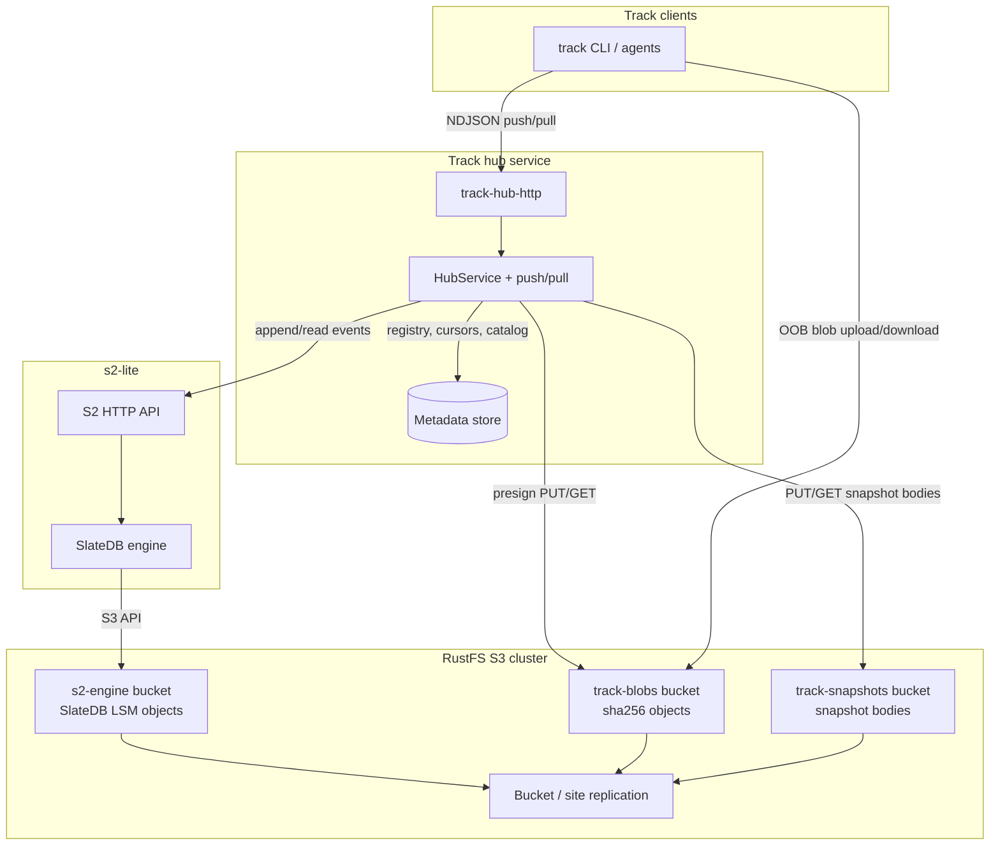
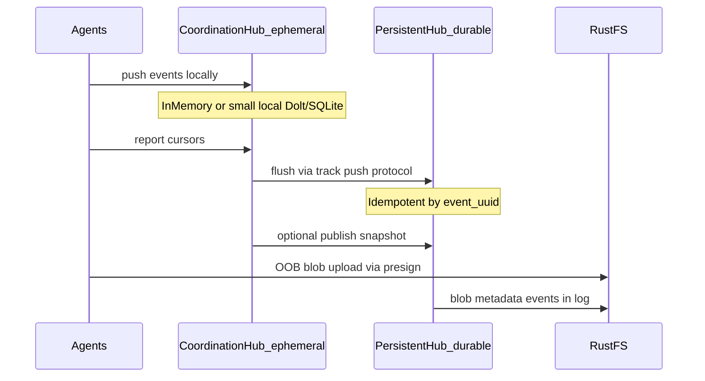

# Durable hub backend assessment: s2-lite, Dolt, Postgres + RustFS

> **Status:** Research (not a decision record)\
> **Date:** 2026-06-19\
> **Branch context:** `poc/persistent-hub-options`

Assessment of durable Track hub backends — s2-lite + RustFS, planned Postgres,
and Dolt + RustFS — against three storage goals (large attachments, off-site DR,
OOB blobs) plus a future federation model where ephemeral coordination hubs
flush to persistent hubs.

## Follow-up work

- [ ] Validate hybrid mapping: HubLog→s2-lite, metadata→SQL, blobs/snapshots→RustFS
      against all four hub traits and HUB-CONF requirements
- [ ] Draft DR runbook: RustFS replication + single-writer s2-lite failover +
      metadata store recovery
- [ ] Spike s2-sdk HubLog adapter: idempotent append, cursor pull, trim — using
      s2-testcontainers
- [ ] Design hub HTTP presign API for blob upload/download aligned with ADR 0003
      `blob.*` events
- [ ] Compare ops/TCO vs track-hub-postgres + RustFS blobs for target deployment
      (single-tenant vs multi-tenant)
- [ ] Map all four hub traits to Dolt SQL tables; spike sqlx/mysql HubLog adapter
      and `dolt_commit`/`dolt_push` flush semantics
- [ ] Design coordination-hub→persistent-hub flush using ADR 0004 push/snapshot
      protocol; document where Dolt push/pull complements vs conflicts with
      event-level merge

## Context: what Track’s hub must durably store

Track’s hub is **not** a mutable issue database. Per [ADR
0003](../adr/0003-domain-model-and-replication-log.md) and [ADR
0004](../adr/0004-hub-sync-protocol-and-compaction.md), it is a **durable
replication service** composed of four storage traits ([new-hub
guide](../dev/src/guides/new-hub-implementation.md)):

| Trait | Data | Access pattern |
| --- | --- | --- |
| [`HubLog`](../../crates/track-hub/src/hub_log.rs) | Append-only replication events; monotonic `hub_offset`; idempotent by `event_uuid` | Append, cursor-based pull, compaction prefix delete |
| [`NodeRegistry`](../../crates/track-hub/src/node_registry.rs) | Registered authoring nodes | Upsert / membership check |
| [`CursorReports`](../../crates/track-hub/src/cursor_reports.rs) | Latest per-replica `CursorSet` | Frequent overwrite, list-all for compaction |
| [`SnapshotCatalog`](../../crates/track-hub/src/snapshot_catalog.rs) | Published snapshot descriptors | Publish + list-by-project |

Blobs are **metadata-only** in the log today
([`BlobMetadata`](../../crates/track-entity/src/work/blob_metadata.rs),
[`BlobStore`](../../crates/track-store/src/blob_store.rs)); bytes are explicitly
**out-of-log** per ADR 0003. Snapshot **bodies** can grow large
([`ProjectSnapshotBody`](../../crates/track-hub-protocol/src/snapshot/project_snapshot.rs));
ADR 0004 follow-on item 4 already flags **external snapshot manifests** as an
open decision.

SRD §5.9 currently says “PostgreSQL or SQLite + event log table/stream” — an
s2-lite stack is an **alternative** to the planned `track-hub-postgres` path,
not a drop-in for it.

---

## Proposed storage topology

**s2-lite on RustFS:** [s2-lite](https://s2.dev/docs/s2-lite) in object-storage
mode uses SlateDB, which speaks S3. Point `AWS_ENDPOINT_URL_S3` at RustFS (same
pattern as MinIO in S2 self-hosting docs). RustFS is [fully
S3-compatible](https://docs.rustfs.com/features/s3-compatibility/) and works
with the [AWS SDK for Rust](https://docs.rustfs.com/developer/sdk/rust.html).

**What lands where:**

| Data | Store | Notes |
| --- | --- | --- |
| Replication events | s2-lite stream(s) | Small JSON envelopes; well under S2’s ~1 MiB/batch append limit |
| SlateDB engine files | RustFS `s2-engine` bucket | Opaque LSM objects (manifest, WAL, levels) — not user-facing |
| Attachment bytes | RustFS `track-blobs` | Content-addressed `/{sha256}`; metadata via `blob.*` events |
| Snapshot bodies | RustFS `track-snapshots` | `/{snapshot_uuid}` or chunked manifest; descriptor stays in hub metadata / log |
| Node registry, cursor reports, snapshot catalog, `event_uuid` index | See architectures below | **Not** naturally stored in S2 streams |

---

## Goal 1: Very large attachments

**Verdict: Strong fit (RustFS direct); s2-lite is not the blob store.**

Track’s model already matches S2’s documented large-payload pattern: **bytes in
object storage, pointer/metadata in the stream** ([S2 appends
concept](https://s2.dev/docs/concepts/appends.md), ADR 0003 §attachments).

| Concern | Assessment |
| --- | --- |
| Size limits | S2 appends cap batches at ~1 MiB / 1000 records — unsuitable for attachment bytes. RustFS/S3 has no practical per-object ceiling for issue-tracker attachments. |
| Dedup | [`BlobMetadata.sha256`](../../crates/track-entity/src/work/blob_metadata.rs) maps cleanly to CAS keys in `track-blobs`. |
| Replication | `blob.add` / `blob.link` events replicate intent; bytes replicate via RustFS bucket replication independently. |
| Local nodes | Nodes keep metadata in SQLite [`BlobStore`](../../crates/track-store/src/blob_store.rs); lazy-fetch bytes from hub/RustFS on demand (not yet implemented). |
| Gap | No hub byte I/O API, no `BlobReducer` implementation, no presign endpoints in [`track-hub-http`](../../crates/track-hub-http/) — all required regardless of backend choice. |

**Recommended flow:**

1. Client requests upload slot from hub.
2. Hub returns presigned **PUT** to `track-blobs/{sha256}` (RustFS).
3. Client uploads OOB.
4. Hub appends `blob.add` / `blob.link` to s2-lite stream with `{blob_uuid,
   sha256, size_bytes, mime_type, file_name}`.
5. Download: presigned **GET** or hub-proxied GET from same bucket.

---

## Goal 2: Local RustFS replication for backup / DR

**Verdict: Strong fit for storage; moderate fit for stream API availability.**

[RustFS multi-site / bucket
replication](https://docs.rustfs.com/features/replication/) can replicate all
three buckets off-site. Requirements to plan for:

- **Versioning enabled** on source and target buckets (replication docs require
  it).
- **Separate replication rules** per bucket (engine vs blobs vs snapshots may
  target different regions or schedules).
- **Eventual consistency** across sites — acceptable for backup/DR, not for
  active-active hub writes.

**s2-lite constraint (critical):** [s2-lite is
single-instance](https://s2.dev/docs/s2-lite) with SlateDB manifest fencing —
**do not run two writers against the same `--path` prefix**. RustFS
active-active replication and s2-lite single-writer semantics are mismatched.

| Layer | DR mechanism | RPO/RTO expectation |
| --- | --- | --- |
| RustFS buckets | Async bucket or site replication | Storage RPO = replication lag; storage survives site loss |
| s2-lite process | Manual failover: stop primary, start **one** instance on secondary site reading replicated `s2-engine` prefix | Stream API RTO = detection + failover runbook + replication catch-up |
| Hub metadata store | Replicate with same DR strategy as chosen metadata backend (disk snapshot, Postgres replica, etc.) | Must not be forgotten in DR drills |
| Clients | Resume push/pull against new hub endpoint; cursors are durable in client SQLite | Sync protocol already supports catch-up |

**DR runbook sketch:** replicate `s2-engine`, `track-blobs`, `track-snapshots` →
on failover, promote secondary RustFS, start s2-lite against replicated engine
prefix, restore metadata store, repoint DNS/TLS.

**Not covered by RustFS replication alone:** hub process HA, automatic s2-lite
leader election, or cross-site linearizable appends.

---

## Goal 3: OOB upload/download paths for blobs

**Verdict: Strong fit via RustFS; not available through s2-lite.**

- **S2 / s2-lite:** No presigned append API. All record writes go through the
  S2 HTTP API ([append endpoint](https://s2.dev/docs/api/records/append)).
- **RustFS:** Standard S3 presigned PUT/GET documented for
  [Python](https://docs.rustfs.com/developer/sdk/python.html), Java, JS; Rust
  uses AWS SDK with `endpoint_url` + path-style ([Rust SDK
  guide](https://docs.rustfs.com/developer/sdk/rust.html)).

OOB is **blob-bucket only**. Replication events and snapshot fetches can also be
OOB (client GETs snapshot object directly after hub returns manifest + URL) —
useful for large snapshot bodies.

**Security note:** s2-lite [lacks granular access
tokens](https://s2.dev/docs/s2-lite) today; gate s2-lite and presign issuance
behind hub auth (mTLS, reverse proxy, short-lived presign TTL, sha256-bound PUT
keys).

---

## Hub backend architectures: hybrid vs pure

### Option A — Hybrid (recommended)

| Component | Technology |
| --- | --- |
| `HubLog` | s2-lite basin/stream via [`s2-sdk`](https://docs.rs/s2-sdk/latest/s2_sdk/) |
| Blobs + snapshot bodies | RustFS direct (AWS SDK) |
| `NodeRegistry`, `CursorReports`, `SnapshotCatalog`, `event_uuid → hub_offset` index | Small durable metadata store (SQLite for dev/single-node; Postgres for multi-tenant prod) |

**Why recommend hybrid:**

1. **Matches Track traits.** [`InMemoryHubLog`](../../crates/track-hub/src/in_memory/in_memory_hub_log.rs)
   needs `by_uuid` dedup index and `fetch_after_cursors` filtering — a side
   index is required unless you rebuild these on every read from the stream.
2. **Matches mutable hub state.** `CursorReports` and `NodeRegistry` are
   **latest-value**, not append-only history. Forcing them into streams adds
   read amplification and awkward compaction.
3. **Matches SRD wording.** “Durable DB + event log stream” is literally this
   split.
4. **Lower adapter risk.** Implement `HubLog` for s2-lite; keep metadata traits
   on SQL that already matches [`track-hub-postgres`
   plans](../dev/src/guides/new-hub-implementation.md).
5. **Snapshot externalization is already anticipated.** ADR 0004 follow-on #4;
   store `ProjectSnapshot` JSON in RustFS, keep `PublishedSnapshot` + manifest
   pointer in SQL/catalog.

**`HubLog` adapter sketch (hybrid):**

- One stream per workspace (or per project if isolation desired):
  `replication`.
- `hub_offset` = s2 sequence number (or mapped offset table in metadata store
  if gaps unacceptable).
- On append: check `event_uuid` in metadata index → if miss, `stream.append()`
  via s2-sdk, record `(event_uuid, hub_offset)` in index.
- On pull: read from stream after min cursor offset; filter by `node_uuid` /
  `project_uuid` (same logic as in-memory impl).
- On compact: s2 stream trim + index trim through watermark.

Use [`s2-testcontainers`](https://docs.rs/s2-sdk/latest/s2_sdk/) for conformance
tests per s2-sdk docs.

### Option B — Pure (s2-lite + RustFS only, no SQL)

| Component | Technology |
| --- | --- |
| Replication events | s2-lite streams |
| Blobs + snapshots | RustFS |
| Node registry | Dedicated s2 stream + consumer maintains latest map (or separate keyed object per node in RustFS) |
| Cursor reports | Latest-value objects in RustFS (`cursors/{workspace}/{reporter}.json`) or a dedicated “state” stream with trim-by-key semantics (non-native) |
| Snapshot catalog | RustFS manifest index per project |
| `event_uuid` index | RustFS object per uuid or embedded in stream headers |

**Assessment:**

| Pro | Con |
| --- | --- |
| Single storage vendor (RustFS) for all bytes | Reimplements a database with S3 LIST/GET semantics |
| No Postgres ops | Cursor report + idempotency lookups become high-latency without careful caching |
| Theoretically simpler deployment manifest | Harder to pass [`DurableHubFixture`](../../crates/track-sync-testing/src/hub_fixture.rs) / HUB-CONF suites efficiently |
| | s2-lite maturity + no token API increases auth burden on custom glue |
| | Compaction watermarks need cross-stream coordination |

**Verdict:** Feasible for a **single-node, self-hosted, minimal-ops**
deployment, but **not recommended** as the primary production architecture. You
trade Postgres complexity for bespoke consistency logic.

---

## s2-lite-specific fit for `HubLog`

| Requirement | Fit | Notes |
| --- | --- | --- |
| Append-only durable log | Good | s2-sdk `append` / `AppendSession` with `await_durable` |
| `AckLevel::Durable` | Good | Ack after SlateDB flush to RustFS; latency ≈ `SL8_FLUSH_INTERVAL` + PUT latency ([s2-lite comparison](https://s2.dev/docs/s2-lite)) |
| Idempotent `event_uuid` | Gap | Requires metadata index (hybrid) or scan/cache (pure) |
| Monotonic `hub_offset` | Good | Map to stream seq; document 1:1 mapping |
| Per-node cursor pull | Good | Client-side filter over ordered stream (existing in-memory pattern) |
| `compact_through` | Good | S2 explicit trim APIs (verify against ADR 0004 tombstone retention rules) |
| NDJSON push/pull HTTP | Neutral | Clients keep using `track-hub-http`; s2 is internal to hub |
| Conformance tests | Good | s2-lite intended as CI emulator; use testcontainers |

**Latency:** Issue-tracker sync tolerates hundreds-of-ms durable acks more
easily than trading systems; colocate s2-lite with RustFS. Tune
`SL8_FLUSH_INTERVAL` vs PUT cost.

**Maturity:** s2-lite is newer than managed [s2.dev
GA](https://s2.dev/docs/s2-lite); acceptable for self-hosted if you own the
runbook.

---

## Postgres vs s2-lite (summary)

Postgres (planned) and hybrid s2-lite + RustFS differ mainly on **where the
event log lives** (SQL rows vs S2 stream on RustFS). Both still need **RustFS
for blobs** if attachments are first-class. See the **four-way comparison**
below for Dolt and coordination-hub columns.

---

## Dolt as a hub backend

[Dolt](https://www.dolthub.com/docs/introduction/what-is-dolt/) is a
**MySQL-compatible SQL database with Git-style version control** — fork, clone,
branch, merge, push, and pull on tables, not just files. It positions itself for
[offline-first](https://www.dolthub.com/docs/introduction/use-cases/offline-first/)
apps that write locally and sync deltas to a peer when connectivity returns.

### How Dolt maps to Track hub traits

Unlike s2-lite (stream-native log + side metadata), Dolt can hold **all four hub
traits in one database**, similar to the planned Postgres backend:

| Trait | Dolt mapping |
| --- | --- |
| `HubLog` | `hub_events` table (append-only rows); `event_uuid` unique index for idempotency |
| `NodeRegistry` | `hub_nodes` table |
| `CursorReports` | `hub_cursor_reports` table (latest-value upserts) |
| `SnapshotCatalog` | `hub_snapshots` table + pointer to RustFS object for large bodies |

Rust integration uses standard MySQL clients
([sqlx](https://github.com/launchbadge/sqlx),
[Diesel](https://dolthub.com/blog/2024-08-30-dolt-diesel-getting-started/)) — no
native Rust SDK. Version-control operations (`dolt_commit`, `dolt_push`,
`dolt_pull`, `dolt_merge`) are SQL stored procedures / system tables.

**Blobs and snapshots:** Dolt is **not** an object store. Large attachment bytes
and external snapshot bodies still land in **RustFS** (same as
Postgres/s2-lite). Dolt stores metadata and pointers only.

### Dolt vs the three storage goals

| Goal | Dolt fit | Notes |
| --- | --- | --- |
| Large attachments | **Strong (with RustFS)** | Same CAS + presign pattern as other SQL backends |
| Off-site DR | **Moderate** | `dolt push` / `dolt pull` to [DoltHub/DoltLab](https://www.dolthub.com/docs/introduction/what-is-dolt/) remotes, or standby replication; **plus** RustFS bucket replication for blobs. No single integrated DR story across SQL + object layers. |
| OOB blob paths | **Strong (via RustFS)** | Identical to Postgres/s2-lite — presign on blob bucket |

### Dolt-specific strengths

1. **Offline-first sync model** — documented clone/push/pull workflow aligns
   with disconnected laptop use ([use
   cases](https://www.dolthub.com/docs/introduction/use-cases/)).
2. **Bulk state handoff** — `dolt commit` + `dolt push` can move an entire hub
   database state as a versioned unit, not just event-by-event.
3. **Branch-per-session** — a coordination hub could run on a branch
   (`agent-run-abc`), then merge or push to `main` on the persistent hub.
4. **Built-in audit** — cell-level history via `dolt_diff_*` system tables;
   complements (but does not replace) Track's immutable event log.
5. **Unified store** — no stream + SQL split; all hub traits in one engine.

### Dolt-specific risks

1. **MySQL, not Postgres** — Track's SRD and infra (`hub.yaml`, docker-compose
   Postgres 16) assume Postgres. Dolt is a **protocol pivot** (MySQL wire
   format).
2. **Dual merge semantics** — Track converges via **event replay + reducers**
   (ADR 0003). Dolt merges at **table/SQL layer**. Using `dolt_merge` for
   federation without going through event idempotency risks two sources of
   truth.
3. **Append-only log vs version history** — every `dolt_commit` versions all
   changed tables. A high-churn `hub_events` table produces deep Dolt history
   unless aggressively garbage-collected (`dolt gc`), potentially fighting ADR
   0004 compaction (prefix delete).
4. **Ecosystem maturity in Track** — no `track-hub-dolt` crate, no conformance
   fixture, no infra templates.
5. **Operational surface** — another database product to run; benefits overlap
   partially with Track's existing event-sourced design.

**Verdict for Dolt:** Strong **coordination / federation adjunct**, moderate
**primary durable hub** unless you explicitly want Git-for-data operations on
hub tables. Best paired with **protocol-first federation** (below), using Dolt
push/pull for bulk snapshots rather than as the conflict-resolution layer.

---

## Federation and coordination hubs

### Envisioned use case

A **low-resource coordination hub** (possibly in-memory) runs on a laptop while
a collection of agents work locally. When the session ends, the coordination hub
**flushes** its events (and optionally entity state) to a longer-running
**persistent hub**.

This is **out of MVP scope** today (SRD §9 lists multi-workspace hub federation
as post-MVP; [gap log HUB_SYNC-077](../plans/replication-sync-gap-log.md)
sketches `{hub-number}.{sequence}` display ids for federated hubs). The
architecture already supports the building blocks:

- **Ephemeral hub:** [`InMemoryHubService`](../../crates/track-hub/src/in_memory/)
  and [`track-hub-memory`](../dev/src/crates/track-hub-memory.md) — zero
  external deps, passes all ephemeral HUB_SYNC suites.
- **Client sync:** [`track-sync`](../../crates/track-sync/) push/pull with
  idempotent `event_uuid` and cursor-based catch-up.
- **Bulk bootstrap:** published snapshots + tail pull
  ([`snapshot_bootstrap.rs`](../../crates/track-sync/src/snapshot_bootstrap.rs)).

### Three flush strategies (backend-agnostic core + storage-specific bulk)

| Strategy | Mechanism | Best backend fit |
| --- | --- | --- |
| **Event replay (recommended core)** | Coordination hub acts as a **client** of the persistent hub: `track push` all events, then peers `track pull`. Idempotency via `event_uuid` handles duplicates. | **All backends** — uses existing ADR 0004 protocol; no new federation spec required. |
| **Snapshot handoff** | Publish `ProjectSnapshot` on coordination hub → push snapshot descriptor + body manifest to persistent hub → persistent hub peers bootstrap from snapshot + pull tail. | **All backends**; large bodies favor **RustFS external manifests**. |
| **Storage-level bulk push** | `dolt commit` + `dolt push` (or DB dump/restore) moves entire hub DB state. | **Dolt strongest**; awkward for s2-lite (stream export); possible but heavy for Postgres (pg_dump/restore). |

**Recommendation:** Treat **event replay via ADR 0004 push** as the canonical
federation/flush path. Storage-level bulk push (Dolt) is an **optimization** for
large session handoffs, not the conflict-resolution layer. Track reducers remain
authoritative for merge semantics.

### Backend comparison on federation

| Dimension | In-memory / SQLite coord hub | Postgres persistent | s2-lite + RustFS | Dolt + RustFS |
| --- | --- | --- | --- | --- |
| Coordination hub footprint | **Best** (in-memory) | Heavy for laptop | s2-lite process + RustFS overkill locally | `dolt sql-server` moderate; embedded file DB |
| Flush via push protocol | **Native** | **Native** | **Native** | **Native** |
| Bulk session handoff | Snapshot export only | pg_dump / logical replication | Stream export + metadata snapshot | **`dolt push` / branch merge** |
| Multi-hub federation (long-term) | N/A | Standard SQL replication; event push between hubs | Event push; stream forwarding non-trivial | **Git remotes + event push**; watch merge-semantics conflict |
| Hub-assigned issue numbers (HUB_SYNC-077) | Local sequence; prefix on federation | Central sequence | Central sequence | Central or per-hub branch sequence |
| Offline agent session | **Designed for this** | Requires local coord hub | Requires local coord hub | **Explicit product fit** ([offline-first](https://www.dolthub.com/docs/introduction/use-cases/offline-first/)) |

### Coordination hub recommendation

For the laptop/agent use case specifically:

1. **Run `InMemoryHubService` (or `track-hub-memory` HTTP)** as the
   coordination hub — lowest resource, already conformance-tested.
2. **Agents register as nodes** and push/pull against `localhost` — no durable
   backend needed during the session.
3. **On session end**, a flush orchestrator (CLI command or orchestrator hook):
   - Pushes all coordination-hub events to the persistent hub upstream
     (idempotent).
   - Uploads session blobs to RustFS (presigned or proxied).
   - Optionally publishes a snapshot for fast peer bootstrap.
4. **Consider Dolt** only if sessions must **survive hub process restarts**
   mid-session without pushing to the persistent hub yet — a local Dolt file DB
   is lighter than a full persistent stack but heavier than in-memory.

**Do not** require s2-lite on the laptop for coordination; reserve
s2-lite/RustFS for the persistent tier where DR and blob volume matter.

---

## Four-way backend comparison

| Dimension | Postgres (planned) | Hybrid s2-lite + RustFS | Dolt + RustFS | In-memory coord hub |
| --- | --- | --- | --- | --- |
| Event log | `hub_events` table | s2-lite stream | `hub_events` table | `InMemoryHubLog` vector |
| Hub metadata | Same DB | Side SQL store | Same Dolt DB | In-process maps |
| Large blobs | RustFS (needed) | RustFS native | RustFS (needed) | Not durable; flush to RustFS |
| OOB blobs | Presign via S3 | Presign via S3 | Presign via S3 | Presign against persistent hub |
| Off-site DR | Postgres replication + RustFS repl | RustFS repl; manual s2-lite failover | Dolt remote push + RustFS repl | N/A (ephemeral) |
| Federation / flush | Event push (native) | Event push (native) | Event push + optional `dolt push` | **Source** of flush |
| Rust ecosystem fit | `tokio-postgres` / `sqlx` Postgres | `s2-sdk` + AWS S3 SDK | `sqlx` MySQL / Diesel | Existing crates |
| SRD alignment | **Literal match** §5.9 | Alternative (stream log) | Alternative (MySQL not Postgres) | Ephemeral reference impl |
| Ops complexity | Postgres + RustFS | RustFS + s2-lite + metadata DB | Dolt + RustFS | None |

---

## Overall verdict

### Against the three storage goals

| Goal | Rating | Primary enabler |
| --- | --- | --- |
| Large attachments | **Strong** | RustFS direct CAS (all durable backends); metadata in hub log |
| Off-site replication / DR | **Strong for data, moderate for service** | RustFS bucket/site replication; backend-specific hub failover (manual for s2-lite; standard for SQL/Dolt) |
| OOB blob paths | **Strong** | RustFS presigned URLs via AWS SDK (backend-agnostic) |

### Recommended tiered architecture

| Tier | Role | Recommended backend |
| --- | --- | --- |
| **Coordination hub** (laptop / agent session) | Low-latency local sync between agents | **`InMemoryHubService`** — already implemented, zero deps |
| **Persistent hub** (long-running) | Durable log, compaction, snapshot catalog | **Postgres + RustFS** (default path: matches SRD §5.9 and existing infra) **or** hybrid **s2-lite + RustFS + metadata SQL** if stream-native log and unified object-store DR are priorities |
| **Federation flush** | Coordination → persistent handoff | **ADR 0004 event push** (canonical); optional **Dolt `dolt push`** for bulk session snapshots |
| **Blobs + snapshot bodies** | All tiers | **RustFS** (shared instance; coordination hub uploads via persistent hub presign or staged local → flush) |

**Dolt placement:** Valuable as a **federation and offline-session** tool
(branch-per-run, bulk push,
[offline-first](https://www.dolthub.com/docs/introduction/use-cases/offline-first/)
workflows), but **not the default persistent hub** unless you want to
standardize on MySQL wire protocol and accept dual merge semantics with careful
layering. Use Dolt push/pull to move **checkpointed hub state**, not to replace
event-level idempotent push.

**s2-lite placement:** Best on the **persistent tier** as `HubLog` over RustFS
when you want stream semantics and colocated object-store DR. Overkill for
coordination hubs.

**When pure s2+RustFS might still make sense:** single-tenant self-hosted
installs that refuse any SQL process, accept higher custom glue cost, and keep
workspace count small.

**When to reconsider:** if you need multi-AZ **active-active hub writes** with
sub-50ms durable acks, managed [s2.dev](https://s2.dev/docs/s2-lite) or a
traditional SQL WAL may be simpler than operating s2-lite failover yourself.

### Federation implications for future ADR

A future federation ADR should specify:

1. **Canonical merge path** — event replay through reducers, not SQL/Dolt table
   merge.
2. **Coordination hub lifecycle** — ephemeral by default; optional Dolt file DB
   for mid-session durability.
3. **Flush contract** — push all events upstream; report flush cursor; handle
   `event_uuid` duplicates.
4. **Display identity** — per [HUB_SYNC-077](../plans/replication-sync-gap-log.md),
   consider `{hub-number}.{sequence}` if multiple persistent hubs federate.
5. **Blob staging** — session blobs uploaded to RustFS before or during flush;
   `blob.add` events pushed with metadata.

---

## Implementation implications (if pursued later)

Not in scope for this assessment, but the work would cluster as:

**Persistent hub backends (pick one or support multiple):**

1. **`track-hub-postgres`** — planned path; all four traits on Postgres +
   RustFS blobs.
2. **`track-hub-s2`** — `HubLog` impl over `s2-sdk`; metadata SQL; endpoint
   override for s2-lite.
3. **`track-hub-dolt`** — all four traits via sqlx/MySQL; `dolt_commit`/
   `dolt_push` for bulk handoff helpers.

**Shared across backends:**

1. **`track-blob-store-s3`** (RustFS) — CAS put/get/exists, presign helpers.
2. **Hub HTTP routes** — upload slot, download URL, snapshot manifest fetch.
3. **Infra** — RustFS buckets + versioning + replication rules; backend-specific
   hub process; DR runbooks.
4. **Conformance** — `DurableHubFixture` per backend;
   `sync_protocol_all_suite!` and HUB-CONF.

**Federation / coordination (future):**

1. **`track hub flush`** (or orchestrator hook) — push coordination-hub events to
   upstream persistent hub; optional snapshot publish.
2. **Federation ADR** — canonical event-level merge; coordination hub lifecycle;
   blob staging on flush.
3. **Optional Dolt session branch** — local `dolt sql-server` for mid-session
   durability on laptop when in-memory is insufficient.

Existing blob/snapshot **domain model** in Track requires no redesign — this
stack fills the **byte storage and durable log** layers ADR 0003/0004 already
assume. Federation flush reuses the **existing push/pull protocol** rather than
requiring a new transport.
